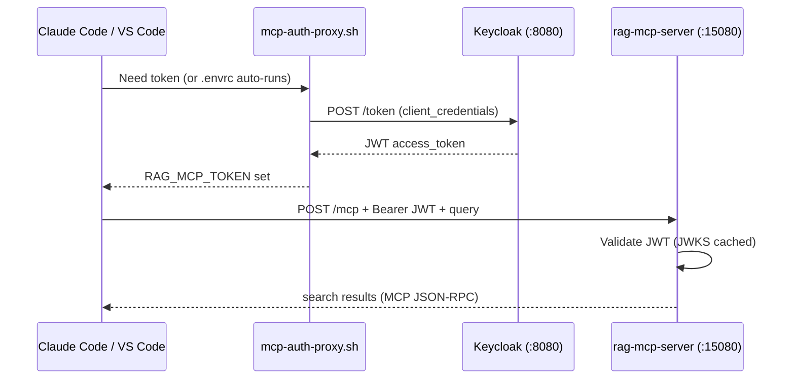
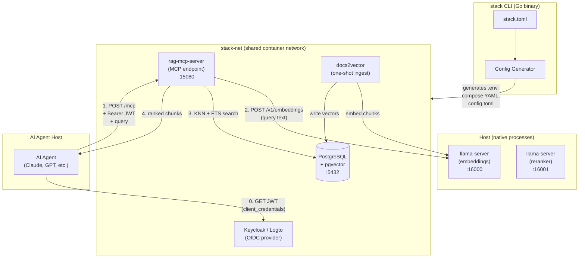
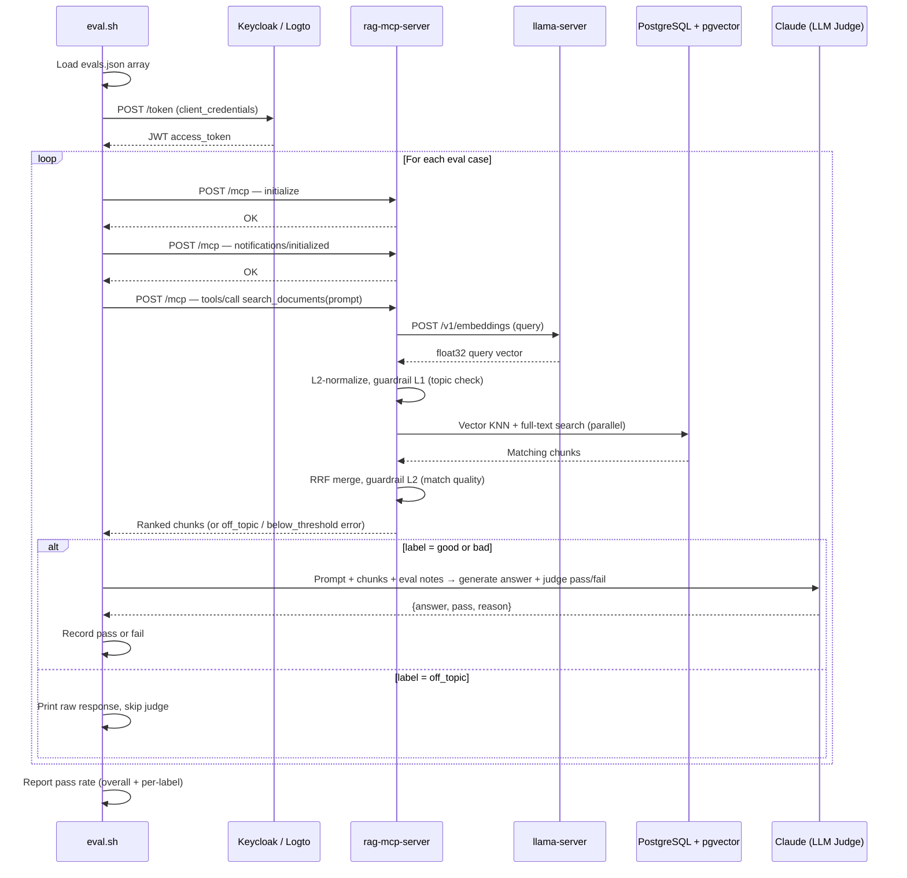

# stack

Single-binary CLI tool that orchestrates the MCP server stack for local development,
integration testing, and RAG dataset building. Reads `stack.toml`, derives all component
configuration from it, and drives podman/docker compose to start or stop the full stack.

## Quick Start

### 1. Prerequisites

Install [Go](https://go.dev/), [Podman](https://podman.io/) (or Docker), and
[uv](https://docs.astral.sh/uv/getting-started/installation/), then:

```sh
cd installers
make submodules       # clones all git submodules
make prereqs          # installs huggingface_hub CLI + podman-compose
cd ..
make build            # produces ./bin/stack + rag-mcp-server tools
```

### 2. Local development setup (optional)

> **Skip this section** if you are connecting to a shared team development
> server that already provides PostgreSQL, llama-server, and Keycloak.
> Jump to [Configure and start the stack](#3-configure-and-start-the-stack)
> and point `stack.toml` at the shared services.

**PostgreSQL + pgvector:**

```sh
cd installers
make install-postgres # installs PostgreSQL and pgvector (macOS or Linux)
make prep-database    # creates role, database, enables pgvector (reads from stack.toml)
cd ..
```

**Inference servers (embedding + reranker):**

```sh
cd installers
make build-llama      # builds llama-server from the llama.cpp submodule
make download-models  # downloads all required GGUF models
cd ..
make run-inference-servers  # starts both servers in the background
```

**Keycloak** is started automatically by `make up` when `"keycloak"` is in
your `stack.toml` profiles. No manual setup is needed.

### 3. Configure and start the stack

```sh
cp stack.toml.example stack.toml
$EDITOR stack.toml    # adjust passwords; on a team server, point to shared services

make up               # generates configs, creates network, starts all services
make ingest           # ingest documents into the vector database
```

Wait for `make up` to report all services healthy. The MCP endpoint is now
listening at `http://localhost:15080/mcp`.

### 3. Get a JWT token

Every request to the MCP server requires a valid JWT. The stack includes
Keycloak (default) or Logto as an OIDC provider. Keycloak is fully automated --
realm, clients, and audience are provisioned on first start.

```sh
# With the default Keycloak config from stack.toml.example:
export OIDC_PROVIDER=keycloak
export KEYCLOAK_ISSUER=http://localhost:8080/realms/dev
export KEYCLOAK_CLIENT_ID=my-app
export KEYCLOAK_CLIENT_SECRET=changeme-dev-secret

TOKEN=$(./rag-mcp-server/scripts/get-token.sh)
echo "$TOKEN"
```

### 4. Test with curl

```sh
# Initialize MCP session
SESSION=$(curl -s -X POST http://localhost:15080/mcp \
  -H "Authorization: Bearer $TOKEN" \
  -H "Content-Type: application/json" \
  -d '{"jsonrpc":"2.0","id":1,"method":"initialize","params":{"protocolVersion":"2025-06-18","capabilities":{},"clientInfo":{"name":"test","version":"0.1"}}}' \
  -D - -o /dev/null 2>&1 | grep -i mcp-session-id | tr -d '\r' | awk '{print $2}')

# Send initialized notification
curl -s -X POST http://localhost:15080/mcp \
  -H "Authorization: Bearer $TOKEN" \
  -H "Content-Type: application/json" \
  -H "Mcp-Session-Id: $SESSION" \
  -d '{"jsonrpc":"2.0","method":"notifications/initialized"}'

# Search documents
curl -s -X POST http://localhost:15080/mcp \
  -H "Authorization: Bearer $TOKEN" \
  -H "Content-Type: application/json" \
  -H "Mcp-Session-Id: $SESSION" \
  -d '{"jsonrpc":"2.0","id":2,"method":"tools/call","params":{"name":"search_documents","arguments":{"query":"how do I reset my password","limit":5}}}' | jq .
```

### 5. Connect from Claude Code

Claude Code supports MCP servers over Streamable HTTP. Because this server
requires JWT authentication, you need to supply a token via headers.

**Option A: Dynamic token refresh with `headersHelper` (recommended)**

Create a script that outputs auth headers as JSON. Claude Code calls it
automatically before each MCP request, so tokens are always fresh:

```sh
#!/usr/bin/env bash
# get-mcp-headers.sh — outputs JSON headers for Claude Code headersHelper
set -euo pipefail

export OIDC_PROVIDER=keycloak
export KEYCLOAK_ISSUER=http://localhost:8080/realms/dev
export KEYCLOAK_CLIENT_ID=my-app
export KEYCLOAK_CLIENT_SECRET=changeme-dev-secret

TOKEN=$(./rag-mcp-server/scripts/get-token.sh)
echo "{\"Authorization\": \"Bearer ${TOKEN}\"}"
```

```sh
chmod +x get-mcp-headers.sh
```

Then add to `.mcp.json` in your project root (or `~/.claude/mcp.json`
for global):

```json
{
  "mcpServers": {
    "rag-search": {
      "type": "http",
      "url": "http://localhost:15080/mcp",
      "headersHelper": "./get-mcp-headers.sh"
    }
  }
}
```

This is the best approach -- tokens are fetched on demand and never go stale.

**Option B: Static token via environment variable**

If you prefer a simpler setup and can tolerate manual token refresh:

```json
{
  "mcpServers": {
    "rag-search": {
      "type": "http",
      "url": "http://localhost:15080/mcp",
      "headers": {
        "Authorization": "Bearer ${RAG_MCP_TOKEN}"
      }
    }
  }
}
```

Claude Code expands `${RAG_MCP_TOKEN}` from your environment. Set it
before launching:

```sh
export RAG_MCP_TOKEN=$(./rag-mcp-server/scripts/get-token.sh)
claude
```

Or automate it in `.envrc` (direnv refreshes on every shell entry):

```sh
# .envrc — auto-refresh token on every shell entry
export OIDC_PROVIDER=keycloak
export KEYCLOAK_ISSUER=http://localhost:8080/realms/dev
export KEYCLOAK_CLIENT_ID=my-app
export KEYCLOAK_CLIENT_SECRET=changeme-dev-secret
export RAG_MCP_TOKEN=$(./rag-mcp-server/scripts/get-token.sh)
```

Tokens expire after 1 hour (default `keycloak.token_lifetime` in
`stack.toml`). With Option B you must re-export `RAG_MCP_TOKEN` and
restart Claude Code when the token expires.

**Option C: CLI one-liner**

```sh
claude mcp add --transport http rag-search http://localhost:15080/mcp \
  --header "Authorization: Bearer $(./rag-mcp-server/scripts/get-token.sh)"
```

### 6. Connect from VS Code (Copilot / Continue / other MCP clients)

VS Code MCP clients that support Streamable HTTP can connect the same way.
Add to your VS Code `settings.json`:

```json
{
  "mcp": {
    "servers": {
      "rag-search": {
        "type": "http",
        "url": "http://localhost:15080/mcp",
        "headers": {
          "Authorization": "Bearer ${RAG_MCP_TOKEN}"
        }
      }
    }
  }
}
```

Set `RAG_MCP_TOKEN` in your environment before launching VS Code, or use
a `.env` file if your MCP client supports it.

For MCP clients that only support stdio transport, use
[mcp-remote](https://github.com/anthropics/mcp-remote) as a bridge:

```sh
TOKEN=$(./rag-mcp-server/scripts/get-token.sh)

npx mcp-remote http://localhost:15080/mcp \
  --header "Authorization: Bearer $TOKEN"
```

Then configure the stdio client to run the `npx mcp-remote` command.

### Authentication summary



---

## Guardrails

The RAG MCP server supports two levels of guardrails that filter queries before
results are returned to the caller. Both are opt-in and configured in
`stack.toml` under `[rag_mcp_server.guardrails]`.

### How guardrails work

**Level 1 -- Topic relevance** prevents off-topic queries from ever reaching
the database. At startup the server embeds the `corpus_topic` string into a
vector. For each incoming query, the cosine similarity between the query vector
and the topic vector is computed. If the score falls below `min_topic_score`,
the server returns an `off_topic` error immediately -- no database query is
executed.

**Level 2 -- Match quality** runs after the database search. If the top
result's cosine similarity score is below `min_match_score`, the server returns
a `below_threshold` error instead of low-quality results. The actual best score
is included in the error response so the caller can log or display it.

### Enabling guardrails

Edit your `stack.toml`:

```toml
[rag_mcp_server.guardrails]
# Level 1: describe what your corpus is about.
# Leave empty to disable Level 1.
corpus_topic    = "Story lines, characters, plots and details of a set of mystery fiction books"
# Minimum cosine similarity between query and corpus_topic to proceed.
min_topic_score = 0.25

# Level 2: minimum cosine similarity for the best search result.
# Set to 0.0 to disable Level 2.
min_match_score = 0.15
```

Then regenerate configs and restart:

```sh
make generate
make down && make up
```

### Tuning thresholds

Set `log_level = "debug"` in `stack.toml` under `[rag_mcp_server]` to see
scores for every query:

```json
{"level":"DEBUG","msg":"topic check","score":0.42,"threshold":0.25,"action":"passed"}
{"level":"DEBUG","msg":"match quality check","best_score":0.71,"threshold":0.15,"action":"passed"}
```

Use the eval harness to calibrate thresholds against known good, bad, and
off-topic queries:

```sh
make eval                                       # uses eval_file from stack.toml
make eval EVAL_FILE=data/my-evals/evals.json    # override on command line
```

Set the default eval file in `stack.toml` so you can just run `make eval`:

```toml
[rag_mcp_server]
eval_file = "data/mystery-books/evals.json"
```

Eval cases with `label: "off_topic"` are printed but excluded from the
pass/fail score, so you can observe what scores off-topic queries receive and
adjust `min_topic_score` accordingly.

**Starting points:**
- `min_topic_score = 0.25` -- works well for narrowly scoped corpora
- `min_match_score = 0.15` -- catches queries that match the topic but have no
  relevant content in the database
- Lower values are more permissive; higher values are stricter

### Adding a system prompt (HyDE)

HyDE (Hypothetical Document Embeddings) generates a hypothetical answer to the
query before embedding it, which can improve retrieval quality. When enabled,
the `system_prompt` field constrains what the LLM will discuss, acting as an
additional guardrail at the generation layer.

```toml
[rag_mcp_server.hyde]
enabled       = true
model         = "claude-haiku-4-5-20251001"
base_url      = ""       # empty = default Anthropic endpoint
system_prompt = "You are only to discuss mystery books. Do not discuss anything else."
```

HyDE requires the `ANTHROPIC_API_KEY` environment variable. Add it to your
`.envrc`:

```sh
export ANTHROPIC_API_KEY="sk-ant-..."
```

Then `direnv allow` and restart the stack.

### Complete example

A fully configured guardrails + HyDE setup in `stack.toml`:

```toml
[rag_mcp_server]
port      = 15080
log_level = "debug"    # use debug while tuning, switch to info for production

[rag_mcp_server.guardrails]
corpus_topic    = "Story lines, characters, plots and details of a set of mystery fiction books"
min_topic_score = 0.25
min_match_score = 0.15

[rag_mcp_server.hyde]
enabled       = true
model         = "claude-haiku-4-5-20251001"
base_url      = ""
system_prompt = "You are only to discuss mystery books. Do not discuss anything else."
```

---

## Architecture

See [docs/DESIGN.md](docs/DESIGN.md) for full architecture.

### System Block Diagram



### End-to-End Call Sequence

See [docs/overall-sequence-diagram.md](docs/overall-sequence-diagram.md) for the
full three-phase startup → ingestion → query sequence.

### Eval Sequence

The eval harness (`rag-mcp-server/scripts/eval.sh`) measures retrieval quality and
hallucination resistance by running each eval case through the live stack. Each case
has a `label` — `good` (answerable), `bad` (fabricated), or `off_topic` — that
determines how the LLM judge scores the answer.

1. The harness authenticates once with the OIDC provider, then iterates over the
   eval JSON array.
2. For each case it sends three MCP messages (`initialize`, `notifications/initialized`,
   `tools/call` with `search_documents`) to retrieve chunks from the running
   rag-mcp-server.
3. For `good` and `bad` cases, the retrieved chunks and the eval prompt are sent to
   Claude, which generates an answer and self-judges whether it passes (correct answer
   for `good`; refusal to confirm the false premise for `bad`).
4. `off_topic` cases skip the judge — the raw MCP response is printed for guardrail
   tuning and excluded from the pass/fail denominator.
5. The harness reports an overall pass rate and per-label breakdown.



### Internal Packages

- `internal/config` — pure TOML parsing and validation
- `internal/engine` — podman/docker detection, all compose/run argv construction
- `internal/generate` — derives values from config, writes ephemeral env/YAML/TOML files
- `internal/compose` — lifecycle: up, down, restart, status, logs
- `internal/ingest` — one-shot docs2vector container run

Only dependency outside the Go standard library: `github.com/BurntSushi/toml`.

## Prerequisites

The stack requires the following tools installed on your system:

- **Go** — to build the stack CLI
- **Podman** (or Docker) — container engine
- **uv** — Python tool installer ([install](https://docs.astral.sh/uv/getting-started/installation/))

Once `uv` is installed, run the setup targets from the `installers/` directory:

```sh
cd installers
make prereqs          # installs huggingface_hub CLI + podman-compose
make submodules       # clones all git submodules (if not already done)
```

## Build

```sh
make build          # produces ./bin/stack + rag-mcp-server tools
make test           # runs all unit tests
make clean          # removes ./bin/ and .stack/
```

## Configuration

Copy the example config and fill in your values:

```sh
cp stack.toml.example stack.toml
$EDITOR stack.toml
```

`stack.toml` is gitignored. See `stack.toml.example` for all fields and their defaults.

**Secrets must never be stored in `stack.toml`.** Use environment variables instead,
preferably via a `.envrc` file loaded by [direnv](https://direnv.net/):

```sh
# .envrc — create this file; it is gitignored
export ANTHROPIC_API_KEY="sk-ant-..."   # required only when hyde is enabled
```

Then run `direnv allow` to activate it. Both `.env` and `.envrc` are in `.gitignore`.

Key fields:

| Field | Description |
|---|---|
| `profiles` | Active components: `postgres`, `keycloak`, `logto` |
| `runtime.engine` | `podman` or `docker`; omit to auto-detect (prefers podman) |
| `postgres.*` | Shared PostgreSQL+pgvector container or external connection |
| `llama.host_port` | Port where host-native llama-server listens |
| `keycloak.*` | Keycloak + internal postgres (mutually exclusive with logto) |
| `logto.*` | Logto + internal postgres (mutually exclusive with keycloak) |
| `rag_mcp_server.*` | RAG MCP server settings, auth provider, search tuning, eval_file |
| `docs2vector.*` | Document ingestion settings |

## Commands

```sh
stack [--config PATH] [--engine ENGINE] [--dry-run] <command>

  up          Generate configs and start all active components
  down        Stop all active components
  restart     Down then up
  status      Show compose ps for all active components
  logs        Stream logs (--component NAME to filter)
  ingest      Build docs2vector image and run one-shot ingestion
  generate    Write all generated files without starting containers
  validate    Validate stack.toml without writing any files
```

Global flags can appear before or after the subcommand name.

### Examples

```sh
# Start the full stack
stack up

# Start with an explicit config path
stack --config /path/to/stack.toml up

# Generate files only (no container ops)
stack generate

# Run document ingestion
stack ingest

# Ingest without dropping existing tables
stack ingest --no-drop

# Show logs for a single component
stack logs --component llama

# Dry-run: show what would happen without executing
stack --dry-run up
```

## Generated Files

`stack generate` (and `stack up`) writes these files:

| File | Purpose |
|---|---|
| `.stack/postgres.env` | Postgres container env vars |
| `.stack/compose.postgres.yml` | Postgres compose file |
| `keycloak-testing/.env` | Keycloak env vars |
| `logto-testing/.env` | Logto env vars |
| `rag-mcp-server/.env` | RAG server env vars (DATABASE_URL, API keys) |
| `rag-mcp-server/config.toml` | RAG server config (auth, search, embeddings) |
| `docs2vector/.env` | docs2vector env vars |
| `docs2vector/config.toml` | docs2vector config (embed host, chunk size) |

All `.env` files are written with mode `0600`.

## Networking

All components join an external Docker/Podman network named `stack-net`. The network
is created automatically by `stack up`. Each component runs as a separate compose
project (`stack-postgres`, `stack-keycloak`, `stack-logto`, `stack-llama`, `stack-rag`)
to avoid service name collisions on the shared network.

## Makefile Targets

The project has two Makefiles. The root Makefile is for using the tool; the
`installers/` Makefile is for setting up and installing prerequisites.

**Root Makefile** (`make help`):

| Target | Description |
|---|---|
| `build` | Build the stack CLI and rag-mcp-server tools |
| `test` | Run unit tests |
| `clean` | Remove generated files and binaries |
| `up` | Start all enabled services |
| `down` | Stop all services |
| `restart` | Restart all services |
| `status` | Show service status |
| `logs` | Tail logs (COMPONENT= to filter) |
| `generate` | Generate component configs without starting |
| `validate` | Validate stack.toml |
| `ingest` | Drop and reingest docs |
| `ingest-add` | Add/upsert docs without dropping |
| `eval` | Run RAG evals (EVAL_FILE= or from stack.toml) |
| `eval-stability` | Run evals N times with pass-rate stats |
| `run-inference-servers` | Start embedding and reranker servers in the background |

**Installers Makefile** (`cd installers && make help`):

| Target | Description |
|---|---|
| `prereqs` | Install Python tool prerequisites (uv, huggingface_hub, podman-compose) |
| `submodules` | Initialize and update all git submodules |
| `install-postgres` | Install PostgreSQL and pgvector (macOS or Linux) |
| `prep-database` | Create database role, database, and enable pgvector (reads from stack.toml) |
| `build-llama` | Build llama-server from the llama.cpp submodule |
| `download-models` | Download all GGUF models |
| `llama-server` | Run embedding server (foreground) |
| `reranker-server` | Run reranker server (foreground) |

## Development

```sh
make test           # unit tests
make validate       # validate your stack.toml
make generate       # write generated files (inspect before running up)
make up             # build + generate + start
make down           # stop
make status         # show container status
```

## Troubleshooting

### Keycloak crash-loops with "Killed" on first start

If `podman logs stack-keycloak_keycloak_1` shows repeated lines like:

```
Updating the configuration and installing your custom providers, if any. Please wait.
/opt/keycloak/bin/kc.sh: line 169:    74 Killed   'java' ...
```

Keycloak's JVM is being OOM-killed by the container memory limit. This typically happens
on the first start when Keycloak runs its Quarkus augmentation/build phase, which is more
memory-intensive than normal operation.

**Fix:** Increase the memory limit in `keycloak-testing/compose.yml`:

```yaml
deploy:
  resources:
    limits:
      memory: 2g    # increase from 1g
```

Then restart:

```sh
make down
make up
```

### `make up` hangs after containers start

On older versions of podman (< 5.x), `podman-compose up -d` may not detach properly
when containers have health checks with dependencies. The containers are running — check
with `make status` or `podman ps` in another terminal. Press `Ctrl+C` to return to
your prompt; the containers will continue running in the background.

### `make ingest` fails with "network not found"

The `stack-net` network is created by `make up`. Run `make up` first, then `make ingest`.
