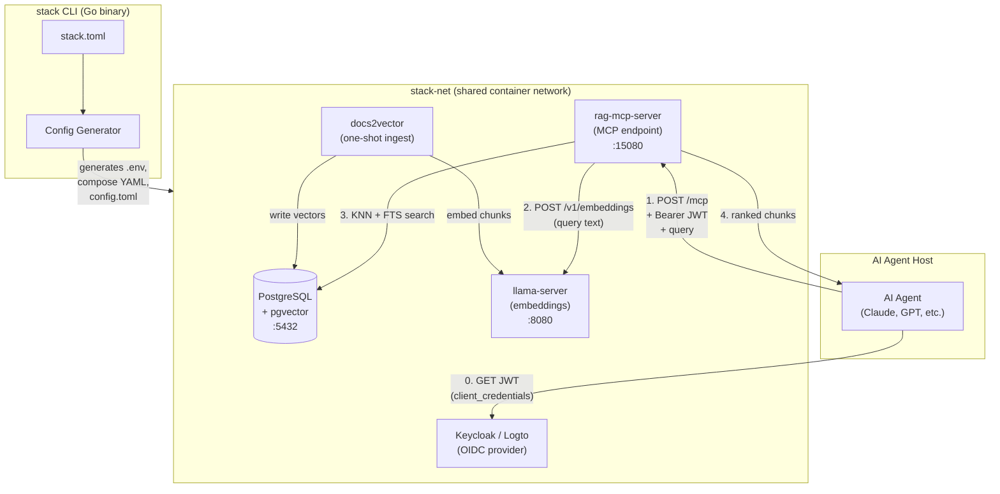
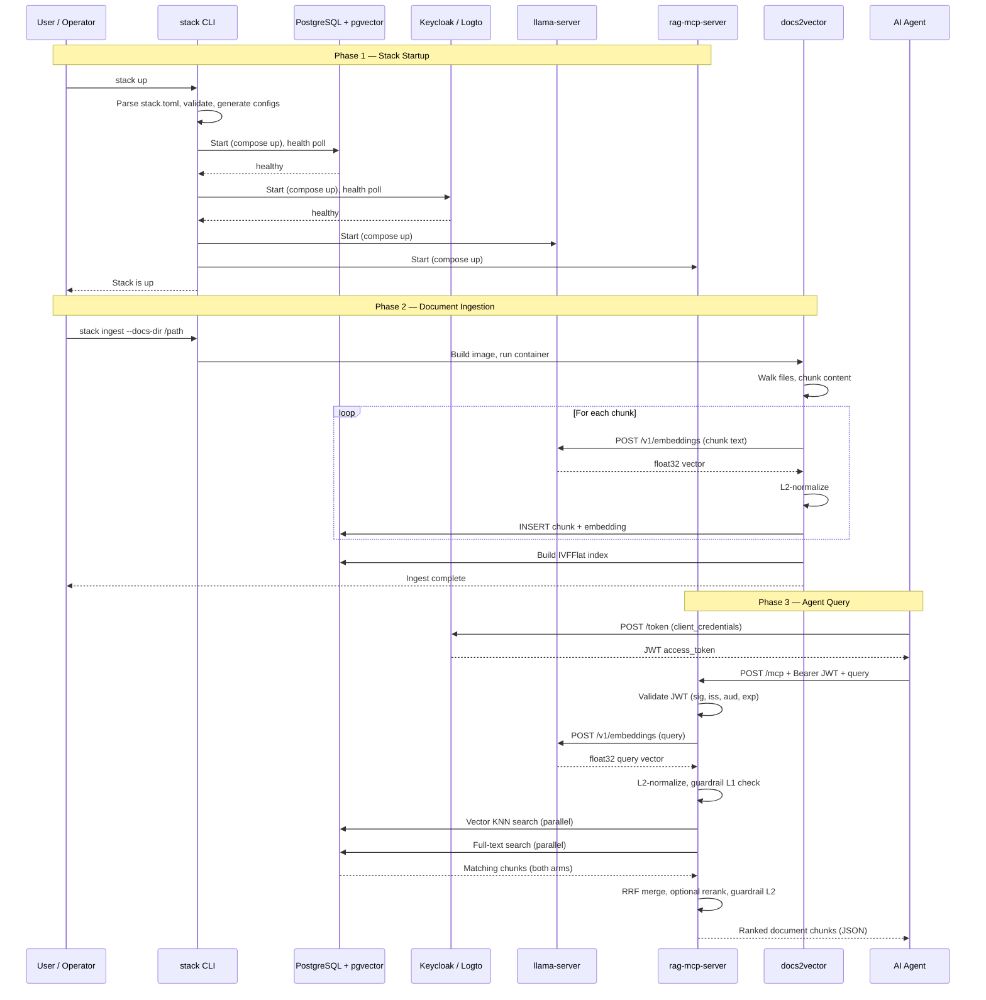

# stack

Single-binary CLI tool that orchestrates the MCP server stack for local development,
integration testing, and RAG dataset building. Reads `stack.toml`, derives all component
configuration from it, and drives podman/docker compose to start or stop the full stack.

## Architecture

See [docs/DESIGN.md](docs/DESIGN.md) for full architecture.

### System Block Diagram



### End-to-End Call Sequence



### Internal Packages

- `internal/config` — pure TOML parsing and validation
- `internal/engine` — podman/docker detection, all compose/run argv construction
- `internal/generate` — derives values from config, writes ephemeral env/YAML/TOML files
- `internal/compose` — lifecycle: up, down, restart, status, logs
- `internal/ingest` — one-shot docs2vector container run

Only dependency outside the Go standard library: `github.com/BurntSushi/toml`.

## Prerequisites

The stack requires the following tools installed on your system:

- **Go** — to build the stack CLI
- **Podman** (or Docker) — container engine
- **uv** — Python tool installer ([install](https://docs.astral.sh/uv/getting-started/installation/))

Once `uv` is installed, run:

```sh
make prereqs
```

This installs:

- `huggingface_hub[cli]` — used to download GGUF model files
- `podman-compose` — required for container orchestration with Podman

## Build

```sh
make build          # produces ./bin/stack
make test           # runs all unit tests
make clean          # removes ./bin/ and .stack/
```

## Configuration

Copy the example config and fill in your values:

```sh
cp stack.toml.example stack.toml
$EDITOR stack.toml
```

`stack.toml` is gitignored. See `stack.toml.example` for all fields and their defaults.

**Secrets must never be stored in `stack.toml`.** Use environment variables instead,
preferably via a `.envrc` file loaded by [direnv](https://direnv.net/):

```sh
# .envrc — create this file; it is gitignored
export ANTHROPIC_API_KEY="sk-ant-..."   # required only when hyde is enabled
```

Then run `direnv allow` to activate it. Both `.env` and `.envrc` are in `.gitignore`.

Key fields:

| Field | Description |
|---|---|
| `profiles` | Active components: `postgres`, `keycloak`, `logto`, `llama` |
| `runtime.engine` | `podman` or `docker`; omit to auto-detect (prefers podman) |
| `postgres.*` | Shared PostgreSQL+pgvector container or external connection |
| `llama.*` | llama-server container; `extra_flags` appended to invocation |
| `keycloak.*` | Keycloak + internal postgres (mutually exclusive with logto) |
| `logto.*` | Logto + internal postgres (mutually exclusive with keycloak) |
| `rag_mcp_server.*` | RAG MCP server settings, auth provider, search tuning |
| `docs2vector.*` | Document ingestion settings |

## Commands

```sh
stack [--config PATH] [--engine ENGINE] [--dry-run] <command>

  up          Generate configs and start all active components
  down        Stop all active components
  restart     Down then up
  status      Show compose ps for all active components
  logs        Stream logs (--component NAME to filter)
  ingest      Build docs2vector image and run one-shot ingestion
  generate    Write all generated files without starting containers
  validate    Validate stack.toml without writing any files
```

Global flags can appear before or after the subcommand name.

### Examples

```sh
# Start the full stack
stack up

# Start with an explicit config path
stack --config /path/to/stack.toml up

# Generate files only (no container ops)
stack generate

# Run document ingestion
stack ingest

# Ingest without dropping existing tables
stack ingest --no-drop

# Show logs for a single component
stack logs --component llama

# Dry-run: show what would happen without executing
stack --dry-run up
```

## Generated Files

`stack generate` (and `stack up`) writes these files:

| File | Purpose |
|---|---|
| `.stack/postgres.env` | Postgres container env vars |
| `.stack/compose.postgres.yml` | Postgres compose file |
| `.stack/llama.env` | llama-server env vars |
| `.stack/compose.llama.yml` | llama-server compose file (includes extra_flags) |
| `keycloak-testing/.env` | Keycloak env vars |
| `logto-testing/.env` | Logto env vars |
| `rag-mcp-server/.env` | RAG server env vars (DATABASE_URL, API keys) |
| `rag-mcp-server/config.toml` | RAG server config (auth, search, embeddings) |
| `docs2vector/.env` | docs2vector env vars |
| `docs2vector/config.toml` | docs2vector config (embed host, chunk size) |

All `.env` files are written with mode `0600`.

## Networking

All components join an external Docker/Podman network named `stack-net`. The network
is created automatically by `stack up`. Each component runs as a separate compose
project (`stack-postgres`, `stack-keycloak`, `stack-logto`, `stack-llama`, `stack-rag`)
to avoid service name collisions on the shared network.

## Development

```sh
make test           # unit tests
make validate       # validate your stack.toml
make generate       # write generated files (inspect before running up)
make up             # build + generate + start
make down           # stop
make status         # show container status
```

## Troubleshooting

### Keycloak crash-loops with "Killed" on first start

If `podman logs stack-keycloak_keycloak_1` shows repeated lines like:

```
Updating the configuration and installing your custom providers, if any. Please wait.
/opt/keycloak/bin/kc.sh: line 169:    74 Killed   'java' ...
```

Keycloak's JVM is being OOM-killed by the container memory limit. This typically happens
on the first start when Keycloak runs its Quarkus augmentation/build phase, which is more
memory-intensive than normal operation.

**Fix:** Increase the memory limit in `keycloak-testing/compose.yml`:

```yaml
deploy:
  resources:
    limits:
      memory: 2g    # increase from 1g
```

Then restart:

```sh
make down
make up
```

### `make up` hangs after containers start

On older versions of podman (< 5.x), `podman-compose up -d` may not detach properly
when containers have health checks with dependencies. The containers are running — check
with `make status` or `podman ps` in another terminal. Press `Ctrl+C` to return to
your prompt; the containers will continue running in the background.

### `make ingest` fails with "network not found"

The `stack-net` network is created by `make up`. Run `make up` first, then `make ingest`.
