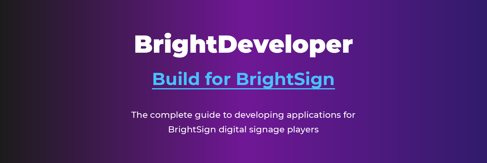

<div align="center">


**Build on BrightSign. Ship in hours, not weeks.**

[](https://brightsign.biz)
[](https://www.bsn.cloud/)

</div>

---

## MCP Server for AI Assistants

Connect your AI coding assistant directly to BrightSign documentation. The **BrightDeveloper MCP Server** gives Claude Code, GitHub Copilot, and other MCP-compatible tools instant access to our complete technical docs.

```bash
# Claude Code quick setup
claude mcp add brightdeveloper --transport http https://brightdeveloper-mcp.bsn.cloud/mcp
```

[**MCP Server Setup Guide →**](MCP-SERVER-HOWTO.md)

---

## What is BrightDeveloper?

**BrightDeveloper** is BrightSign's developer program—clear documentation, working code, and starter projects ready to customize. Whether you're building a CMS, a kiosk application, or an AI-powered analytics solution, we want you to go from idea to production as fast as possible.

Our goal: **your first successful API call in under 15 minutes**, and a clear path from "Hello World" to a fully working application.

This repo contains technical documentation and guides. If you're building a cloud integration, start with the **[gopurple SDK](https://github.com/BrightDevelopers/gopurple)**—it's the fastest way to get working code.

This program is for software developers building on BrightSign. If you just need to create presentations and manage players without writing code, check out [BrightAuthor:connected](https://www.brightsign.biz/brightauthor-connected/) and [BSN.cloud](https://www.brightsign.biz/bsn-cloud/).

---

## Vision & Mission

### Mission
Inspire and empower software developers to build innovative solutions on the BrightSign platform (and enabling AI assistance)

### Vision
Make BrightSign the platform developers choose first. Clear docs, working code, and a complete SDK that AI assistants can use to generate correct, working integrations. Ship in hours, not weeks.

### AI-First Approach
Developers increasingly use LLMs to accelerate their work. **This is the future, and we're building for it.** Every piece of documentation, every code example, and especially our SDK is designed to work seamlessly with AI assistants. When a developer pastes our docs into Claude, Copilot, or Cursor, the generated code should work on the first try.

---

## How We Think About Developer Experience

We've designed everything here for both **humans and AI assistants**. Every guide explains the *why*, not just the *what*. Every code example runs without modification. Paste any of our documentation into Claude, Copilot, or Cursor and get working code.

**Our priorities:**

1. **Cloud-first** — BSN.cloud APIs for managing players, content, and schedules at scale
2. **On-player development** — Chromium (HTML/JavaScript) and Node.js for local applications
3. **Edge AI** — NPU development on XS6 for computer vision and analytics
4. **Extensions** — For capabilities that require going deeper

---

# BSN.cloud

## Start Here: The Go SDK

**[gopurple](https://github.com/BrightDevelopers/gopurple)** is our Go SDK for BSN.cloud—the fastest way to build cloud integrations.

```go
client, _ := gopurple.New()
client.Authenticate(ctx)
devices, _ := client.Devices.List(ctx, nil)
```

The SDK includes **73 working example programs**—not snippets, but complete CLI tools you can run immediately. It handles authentication, pagination, error handling, and remote device control.

**Why Go?** AI writes excellent Go code. Strong typing catches errors at compile time. Single binary deployment—no dependency management. And the patterns translate: AI assistants can reference gopurple to generate correct code in Python, TypeScript, or any language.

---

# BrightSign Players

Build applications that run directly on BrightSign hardware. Choose the development approach that fits your skills and requirements.

### Getting Started

New to BrightSign? Start here to understand the hardware platform, player models, and development options.

[**Introduction to BrightSign Players →**](documentation/part-1-getting-started/01-introduction-to-brightsign-players.md)

### BrightScript

BrightSign's native scripting language for maximum performance and direct hardware control.

[**BrightScript Development →**](documentation/part-2-brightscript-development/README.md)

### Browser-based Apps

Build HTML5/JavaScript applications using the integrated Chromium rendering engine.

[**JavaScript Playback →**](documentation/part-3-javascript-development/01-javascript-playback.md)

### Node Apps

Run server-side JavaScript on the player with access to both Node.js modules and DOM objects.

[**Node.js Programs →**](documentation/part-3-javascript-development/02-javascript-node-programs.md)

### Extensions

Advanced: write compiled-language extensions for custom background services, and system-level integrations. Note that to distribute extensions to non-development players you will be required to have BrightSign "sign" your application bundle.

[**Native Extensions →**](documentation/part-4-advanced-topics/01-intro-to-extensions.md)

---


# What's in This Repo

This repository contains documentation and guides. For working code, see the SDK and example repos.

<table>
<tr>
<td width="33%" align="center" valign="top">

### [Technical Documentation](documentation/README.md)

**In-depth reference materials**

Comprehensive API documentation, language references, and detailed technical specifications.

- BrightScript Language Reference
- JavaScript Development
- Native Extensions & NPU
- BSN.cloud Integration
- Hardware Integrations

[**Explore Documentation →**](documentation/README.md)

</td>
<td width="33%" align="center" valign="top">

### [How-To Articles](howto-articles/README.md)

**Step-by-step guides**

Task-focused tutorials that walk you through common development scenarios.

- Getting started guides
- Integration walkthroughs
- Configuration tutorials
- Troubleshooting guides

[**Browse How-To Articles →**](howto-articles/README.md)

</td>
<td width="33%" align="center" valign="top">

### [Practical Examples](practical-examples/README.md)

**Ready-to-use code**

Code samples and projects for on-player development.

- BrightScript examples
- JavaScript/HTML5 samples
- Node.js applications

*For cloud API examples, see [gopurple](https://github.com/BrightDevelopers/gopurple)*

[**View Examples →**](practical-examples/README.md)

</td>
</tr>
</table>

---

## Support

Need help? BrightSign provides comprehensive support resources:

- **Discussions**: [GitHub Discussions](https://github.com/orgs/BrightDevelopers/discussions) — Ask questions and share ideas
- **Developer Community**: [BrightSign Community Forums](https://github.com/orgs/BrightDevelopers/discussions)
- **Product Documentation**: [docs.brightsign.biz](https://docs.brightsign.biz/)
- **Product Support**: [brightsign.biz/support](https://www.brightsign.biz/support/)

---

## Contributing

We welcome contributions from the community! Please see [CONTRIBUTING.md](CONTRIBUTING.md) for guidelines on how to participate.

---

<div align="center">


**Brought to Life by BrightSign®**

© 2025-2026 BrightSign LLC. All rights reserved.

</div>
