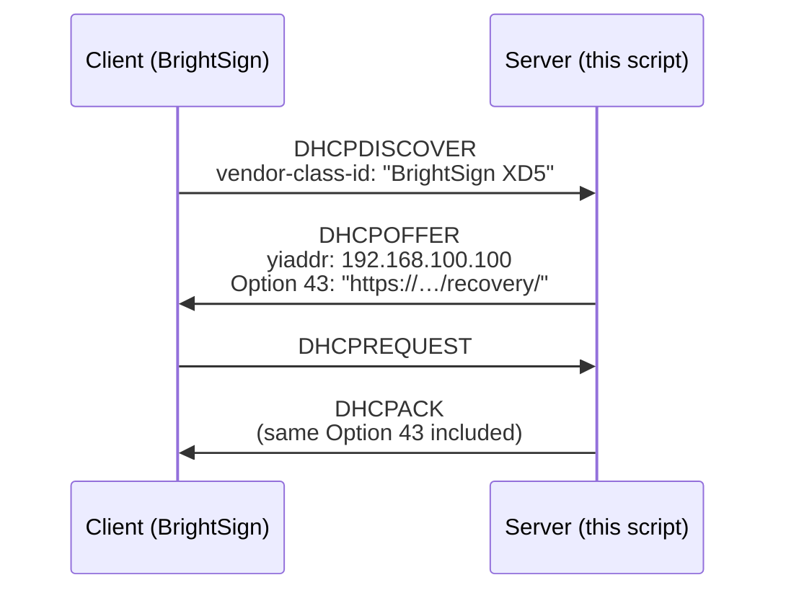
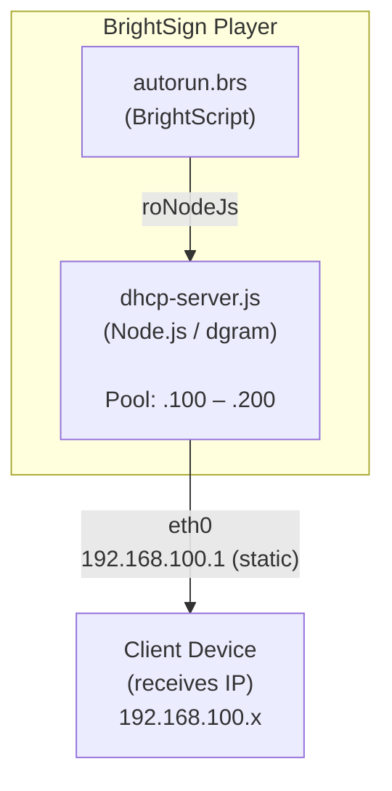

# Running a DHCP Server on a BrightSign Player (Node.js)

[← Back to How-To Articles](README.md) | [↑ Main](../README.md)

---

## Introduction

In most deployments a BrightSign player is a **DHCP client** — it requests an IP address from a router or infrastructure server. Occasionally the player must itself **assign** IP addresses to devices that connect to an isolated or standalone network segment. Common scenarios include:

- **Offline kiosks** — the player is the only networked device; attached tablets or sensors need IPs
- **Event installations** — a self-contained access-point network where the player acts as a gateway
- **Retail pop-ups** — a player acts as a hub for BLE/USB-attached peripheral bridges with IP stacks
- **Option 43 test rigs** — a development bench that needs a DHCP server sending provisioning URLs

### What BrightScript Cannot Do

`roNetworkConfiguration` configures the player as a DHCP *client* only. There is no `roDHCPServer` or equivalent native BrightScript object. Every DHCP reference in the BrightSign OS API treats the player as the entity *receiving* an address, not *distributing* them.

### What Node.js Can Do

Because BrightSign runs Node.js on-device, you can implement a complete DHCP server using the built-in `dgram` (UDP) module. The implementation runs as a standalone Node.js process launched by `roNodeJs` from BrightScript.

---

## Prerequisites

| Requirement | Detail |
|-------------|--------|
| BrightSign OS | 8.5+ (Node.js 14.17.6) or 9.1+ (Node.js 18.18.2) |
| Network interface | Must be set to a static IP on the subnet the server will serve |
| Port 67/68 | Must be free — no other service may hold the DHCP server port |
| Storage | Script file deployed to SD card or USB |

> **Node.js version note:** The implementation below uses only built-in Node.js modules (`dgram`, `net`, `os`) and is compatible with Node.js 14.x and later. No binary npm packages are used, as those are not supported on BrightSign's ARM-based runtime.

---

## Step 1: Configure a Static IP on the Serving Interface

The network interface that will act as the DHCP server must have a fixed IP address. You cannot run a DHCP server on an interface that is itself a DHCP client.

```brightscript
' set-static-ip.brs — Run once to configure eth0 as static before deploying server
Sub Main()
    nc = CreateObject("roNetworkConfiguration", 0)  ' 0 = eth0

    ' Disable DHCP client and assign static address
    nc.SetIP4Address("192.168.100.1")
    nc.SetIP4Netmask("255.255.255.0")
    nc.SetIP4Gateway("192.168.100.1")  ' Player is its own gateway on isolated net
    nc.SetDNSServers(["8.8.8.8", "8.8.4.4"])
    nc.SetTimeServer("http://time.brightsignnetwork.com/")

    nc.Apply()

    print "Static IP applied. Rebooting to take effect..."
    ' RebootSystem()  ' Uncomment to reboot automatically
End Sub
```

After setting a static IP, deploy `dhcp-server.js` (Step 2) to the same storage location and reboot.

---

## Step 2: The DHCP Server Script

Save the file below as `/storage/sd/dhcp-server.js`. It implements the core DHCP handshake (DISCOVER → OFFER → REQUEST → ACK) and supports **DHCP Option 43** for BrightSign automatic provisioning.

<details>
<summary>Click to expand the full DHCP server implementation (dhcp-server.js)</summary>

```javascript
// dhcp-server.js — Minimal DHCP server using raw UDP
// No npm dependencies. Compatible with Node.js 14.x+ (BrightSign OS 8.5+)
"use strict";
const dgram = require("dgram");
const os    = require("os");

// ── Configuration — edit these values for your deployment ───────────────
const SERVER_IP     = "192.168.100.1";   // Player's static IP (eth0/wlan0)
const POOL_START    = "192.168.100.100"; // First address to hand out
const POOL_END      = "192.168.100.200"; // Last address to hand out
const SUBNET_MASK   = "255.255.255.0";
const LEASE_SECONDS = 86400;             // Lease duration: 24 hours

// DHCP Option 43 — BrightSign vendor-specific provisioning URL
// Set OPTION_43_ENABLED = true and provide your bsn.Cloud recovery URL
// to push automatic provisioning configuration to connecting BrightSign players.
const OPTION_43_ENABLED = false;
const OPTION_43_URL     = "https://provision.example.com/recovery/";
// ────────────────────────────────────────────────────────────────────────

const DHCP_SERVER_PORT = 67;
const DHCP_CLIENT_PORT = 68;

// ── IP address utilities ─────────────────────────────────────────────────
function ipToNum(ip) {
    return ip.split(".").reduce((acc, o) => ((acc << 8) + parseInt(o, 10)) >>> 0, 0);
}

function numToIp(n) {
    return [
        (n >>> 24) & 0xFF,
        (n >>> 16) & 0xFF,
        (n >>>  8) & 0xFF,
         n         & 0xFF
    ].join(".");
}

function macFromBuf(buf, offset, len) {
    return Array.from(buf.slice(offset, offset + len))
        .map(b => b.toString(16).padStart(2, "0"))
        .join(":");
}

// ── Lease table ──────────────────────────────────────────────────────────
// Maps MAC address -> { ip, expires }
const leases = new Map();
let poolCursor = ipToNum(POOL_START);
const poolLimit = ipToNum(POOL_END);

function getOrAllocate(mac) {
    const now = Date.now();

    if (leases.has(mac)) {
        const entry = leases.get(mac);
        entry.expires = now + LEASE_SECONDS * 1000; // Renew expiry on re-request
        return entry.ip;
    }

    // Reclaim the first expired lease if the pool is exhausted
    if (poolCursor > poolLimit) {
        for (const [m, e] of leases) {
            if (e.expires < now) {
                leases.delete(m);
                poolCursor = ipToNum(e.ip);
                console.log(`Reclaimed expired lease ${e.ip} from ${m}`);
                break;
            }
        }
    }

    if (poolCursor > poolLimit) {
        console.warn("DHCP address pool exhausted");
        return null;
    }

    const ip = numToIp(poolCursor++);
    leases.set(mac, { ip, expires: now + LEASE_SECONDS * 1000 });
    return ip;
}

// ── DHCP option parser ───────────────────────────────────────────────────
function parseOptions(buf, offset) {
    const opts = {};
    while (offset < buf.length) {
        const code = buf[offset++];
        if (code === 255) break;  // End option
        if (code === 0)   continue; // Pad byte
        const len = buf[offset++];
        opts[code] = buf.slice(offset, offset + len);
        offset += len;
    }
    return opts;
}

// ── DHCP packet parser ───────────────────────────────────────────────────
function parsePacket(buf) {
    if (buf.length < 240) return null;
    if (buf.readUInt32BE(236) !== 0x63825363) return null; // DHCP magic cookie

    const hlen = buf[2];
    return {
        op:    buf[0],      // 1=BOOTREQUEST, 2=BOOTREPLY
        htype: buf[1],      // Hardware type (1 = Ethernet)
        hlen,               // Hardware address length (6 for MAC)
        xid:   buf.readUInt32BE(4),   // Transaction ID
        flags: buf.readUInt16BE(10),  // Broadcast flag
        mac:   macFromBuf(buf, 28, hlen),
        opts:  parseOptions(buf, 240)
    };
}

// ── DHCP response builder ────────────────────────────────────────────────
// msgType: 2 = DHCPOFFER, 5 = DHCPACK
function buildResponse(msgType, req, offeredIp) {
    const buf = Buffer.alloc(548, 0);

    // Fixed fields (RFC 2131 §2)
    buf[0] = 2;           // op: BOOTREPLY
    buf[1] = req.htype;
    buf[2] = req.hlen;
    buf.writeUInt32BE(req.xid, 4);
    buf.writeUInt16BE(req.flags, 10);
    buf.writeUInt32BE(ipToNum(offeredIp), 16); // yiaddr: offered IP
    buf.writeUInt32BE(ipToNum(SERVER_IP),  20); // siaddr: server IP

    // Client hardware address
    req.mac.split(":").forEach((h, i) => { buf[28 + i] = parseInt(h, 16); });

    // DHCP magic cookie
    buf.writeUInt32BE(0x63825363, 236);

    // ── Options ──────────────────────────────────────────────────────────
    let off = 240;
    const w1 = c => { buf[off++] = c; };
    const w4 = n => { buf.writeUInt32BE(n, off); off += 4; };

    // Option 53 – DHCP Message Type
    w1(53); w1(1); w1(msgType);

    // Option 54 – Server Identifier
    w1(54); w1(4); w4(ipToNum(SERVER_IP));

    // Option 51 – IP Address Lease Time
    w1(51); w1(4); w4(LEASE_SECONDS);

    // Option 1 – Subnet Mask
    w1(1); w1(4); w4(ipToNum(SUBNET_MASK));

    // Option 3 – Router (default gateway = the player itself)
    w1(3); w1(4); w4(ipToNum(SERVER_IP));

    // Option 6 – DNS Server (player acts as DNS forwarder or use public DNS)
    w1(6); w1(4); w4(ipToNum(SERVER_IP));

    // Option 43 – Vendor-Specific Information (BrightSign provisioning)
    // BrightSign reads sub-option 85 as the recovery/provisioning URL (TLV format).
    // This allows connecting BrightSign players to auto-provision from this host.
    if (OPTION_43_ENABLED && OPTION_43_URL) {
        const urlBuf = Buffer.from(OPTION_43_URL, "ascii");
        const tlv = Buffer.alloc(2 + urlBuf.length);
        tlv[0] = 85;              // Sub-option code: BrightSign recovery URL
        tlv[1] = urlBuf.length;
        urlBuf.copy(tlv, 2);
        w1(43); w1(tlv.length);
        tlv.forEach(b => w1(b));
    }

    w1(255); // End option marker
    return buf;
}

// ── UDP server ───────────────────────────────────────────────────────────
const server = dgram.createSocket({ type: "udp4", reuseAddr: true });

server.on("error", err => {
    console.error(`[DHCP] Server error: ${err.message}`);
    process.exit(1);
});

server.on("message", msg => {
    const pkt = parsePacket(msg);
    if (!pkt || pkt.op !== 1) return; // Accept BOOTREQUEST only

    const typeOpt = pkt.opts[53];
    if (!typeOpt) return;

    const type = typeOpt[0];
    const ip = getOrAllocate(pkt.mac);
    if (!ip) return;

    if (type === 1) {
        // DHCPDISCOVER → reply with DHCPOFFER (msgType 2)
        const resp = buildResponse(2, pkt, ip);
        server.send(resp, 0, resp.length, DHCP_CLIENT_PORT, "255.255.255.255");
        console.log(`[DHCP] OFFER  ${pkt.mac} → ${ip}`);
    } else if (type === 3) {
        // DHCPREQUEST → reply with DHCPACK (msgType 5)
        const resp = buildResponse(5, pkt, ip);
        server.send(resp, 0, resp.length, DHCP_CLIENT_PORT, "255.255.255.255");
        console.log(`[DHCP] ACK    ${pkt.mac} → ${ip}`);
    }
});

server.on("listening", () => {
    server.setBroadcast(true);
    const addr = server.address();
    console.log(`[DHCP] Server listening on ${addr.address}:${addr.port}`);
    console.log(`[DHCP] Pool: ${POOL_START} – ${POOL_END}`);
    console.log(`[DHCP] Server IP: ${SERVER_IP}`);
    if (OPTION_43_ENABLED) {
        console.log(`[DHCP] Option 43 enabled: ${OPTION_43_URL}`);
    }
});

process.on("SIGTERM", () => {
    console.log("[DHCP] Shutting down");
    server.close();
    process.exit(0);
});

server.bind(DHCP_SERVER_PORT, "0.0.0.0");
```
</details>

---

## Step 3: Launch from BrightScript

Add the following to your `autorun.brs` to start the DHCP server process when the player boots:

```brightscript
' autorun.brs — Launch DHCP server alongside your main application
Sub Main()
    msgPort = CreateObject("roMessagePort")

    ' Enable Local DWS (if not already enabled)
    regNetworking = CreateObject("roRegistrySection", "networking")
    if regNetworking.Read("http_server") <> "80" then
        regNetworking.Write("http_server", "80")
        RebootSystem()
    end if

    dhcpNode = CreateObject("roNodeJs", "SD:/dhcp-server.js", { message_port: msgPort })
    if dhcpNode = invalid then
        print "ERROR: Could not launch DHCP server (Node.js unavailable?)"
        stop
    end if

    print "DHCP server started"

    ' Main application event loop
    while true
        msg = Wait(0, msgPort)
        if type(msg) = "roNodeJsEvent" then
            print "Event: "; msg.GetData()
        end if
        ' Add your other application logic here
    end while
End Sub
```

### Running as a Persistent Extension

For production deployments, consider packaging the server as a Node.js extension so it is managed by the OS init system and restarts automatically on failure. See [Building Custom Extensions](16-building-custom-extensions.md) for the full extension packaging workflow.

---

## Step 4: Enable DHCP Option 43 (Optional)

DHCP Option 43 lets a DHCP server push a provisioning URL to BrightSign players during the DHCP handshake. This is how bsn.Cloud implements automatic device registration without manual configuration.

To enable it on your self-hosted DHCP server, edit the constants at the top of `dhcp-server.js`:

```javascript
const OPTION_43_ENABLED = true;
const OPTION_43_URL     = "https://your-provision-server.example.com/recovery/";
```

**How it works:**



The player extracts the URL from Option 43, downloads the provisioning payload, and completes automatic registration with bsn.Cloud.

> **Note:** The Option 43 used here matches the BrightSign vendor-specific format documented at [docs.brightsign.biz/partners/option-43](https://docs.brightsign.biz/partners/option-43). The encoding is: `[sub-option code (1 byte)][length (1 byte)][URL bytes]`, wrapped in DHCP Option 43.

---

## Verification and Testing

### Check the Server is Listening

From the BrightScript serial/SSH console:

```bash
# Check if port 67 is bound
ss -ulnp | grep 67

# Or with netstat
netstat -ulnp | grep dhcp
```

### Watch Leases in Real Time

The server logs each OFFER and ACK to stdout, which is captured by syslog on BrightSign. Retrieve logs via the Diagnostic Web Server (DWS):

```bash
# Retrieve directly from DWS
curl http://<player-ip>/api/v1/logs --digest -u "admin:<dws-password>"
```

### Verify from a Client Device

Connect a device to the same network segment. It should receive an IP in the `192.168.100.100–200` range with the gateway pointing to `192.168.100.1`.

```bash
# On a Linux/macOS client
ip addr show eth0    # or: ifconfig eth0
ip route show
```

### Validate Option 43 Delivery

Use `tcpdump` or Wireshark on the client side to capture the DHCP exchange and confirm Option 43 is present:

```bash
# On a Linux client, capture DHCP traffic
sudo tcpdump -i eth0 -n port 67 or port 68 -v
```

Look for `option 43` in the OFFER/ACK packets with decoded sub-option 85 containing your URL.

---

## Troubleshooting

| Symptom | Likely Cause | Resolution |
|---------|-------------|------------|
| `EADDRINUSE` on port 67 | Another service holds port 67 | Check for conflicting dnsmasq or dhcpd processes; restart player |
| Clients not receiving IPs | Interface not in broadcast domain | Confirm both devices are on the same subnet/VLAN |
| Clients receive IPs but no routing | Gateway option wrong | Ensure SERVER_IP is reachable and IP forwarding is enabled on the player |
| Option 43 URL not received | OPTION_43_ENABLED still `false` | Set `OPTION_43_ENABLED = true` in `dhcp-server.js` |
| Pool exhausted | Many clients or short lease recycling | Widen `POOL_START`–`POOL_END` range or reduce `LEASE_SECONDS` |
| Static IP reverts after reboot | `nc.Apply()` not called, or conflicting DHCP client setting | Confirm `SetIP4Address` + `Apply()` were both called; check for conflicting `SetDHCP()` calls |

---

## Architecture Diagram



---

## Related Resources

- [Chapter 7: JavaScript Node Programs](../documentation/part-3-javascript-development/02-javascript-node-programs.md) — Full Node.js API reference including UDP/TCP networking
- [Building Custom Extensions](16-building-custom-extensions.md) — Package this as a persistent OS-managed extension
- [Setting Up bsn.Cloud](10-setting-up-bsn-cloud.md) — DHCP Option 43 for cloud provisioning (upstream server config)
- [Secure Deployment Practices](19-secure-deployment-practices.md) — Securing network services on deployed players
- [BrightSign Option 43 Reference](https://docs.brightsign.biz/partners/option-43) — Official vendor-specific option encoding
- [BrightSign roNetworkConfiguration API](https://docs.brightsign.biz/developers/ronetworkconfiguration) — Full client-side network configuration reference

---

<div align="center">


**Brought to Life by BrightSign®**

</div>
