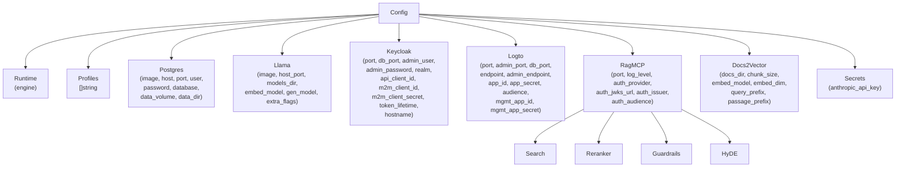
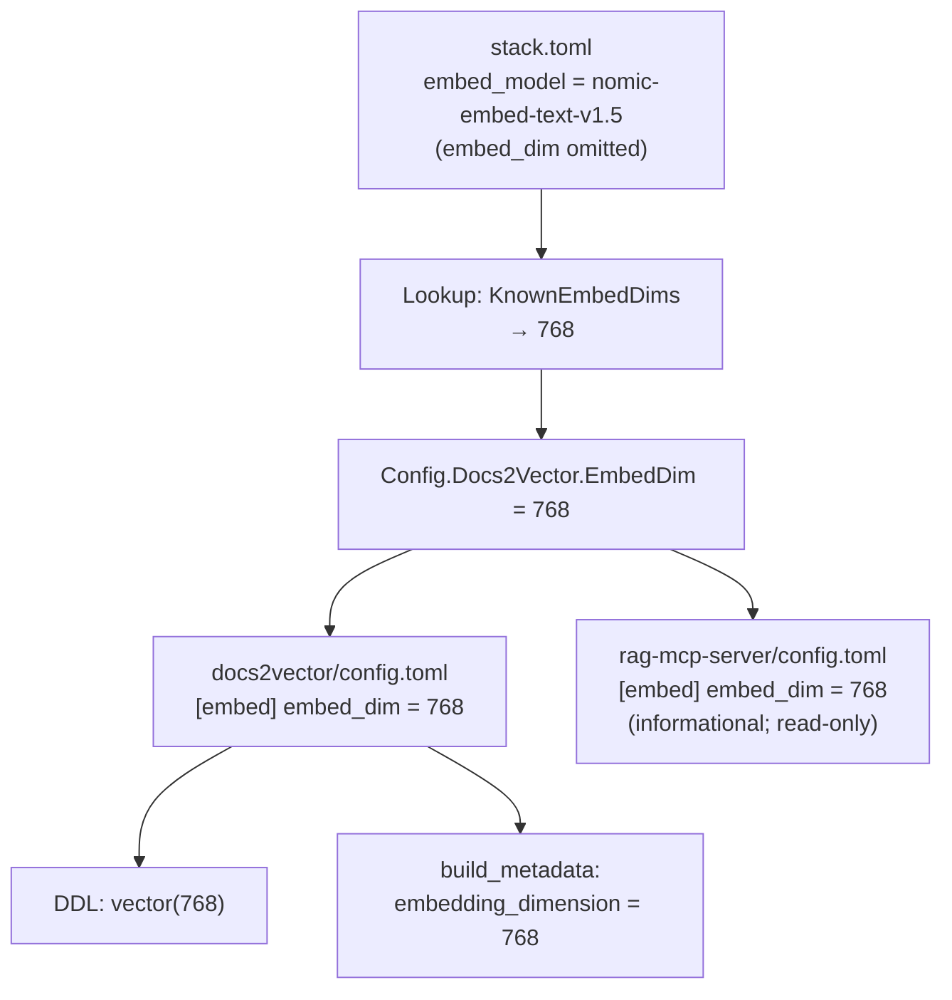

# stack — Design Document

## 1. Overview

`stack` is a single-binary CLI tool written in Go that orchestrates the MCP server
stack for local development, integration testing, and RAG dataset building. It reads
`stack.toml`, derives all component configuration from it, writes ephemeral env and
TOML files, and drives podman/docker compose to start or stop the stack.

Dependencies: only `github.com/BurntSushi/toml` plus the Go standard library.
No cobra or urfave/cli; uses `flag` package with manual subcommand dispatch.

---

## 2. Repository Layout

```
/mcp-servers/
├── stack.toml.example          # committed template
├── stack.toml                  # gitignored — contains secrets
├── Makefile
├── REQUIREMENTS.md
├── docs/DESIGN.md              # this file
├── cmd/stack/main.go           # CLI entrypoint
├── internal/
│   ├── config/                 # stack.toml parsing + validation
│   ├── engine/                 # podman/docker detection + argv builders
│   ├── generate/               # file generation (env, config.toml, compose YAML)
│   ├── compose/                # up/down/status/logs orchestration
│   ├── ingest/                 # docs2vector one-shot container run
│   └── testutil/               # shared test helpers
├── .stack/                     # gitignored — generated runtime files
└── bin/                        # gitignored — compiled binary
```

---

## 3. Package Architecture

### 3.1 cmd/stack — entrypoint

Parses global flags (`--config`, `--engine`, `--dry-run`), identifies the
subcommand, and dispatches to a handler function. Prints usage on error and
exits 1 on any non-nil error from handlers.

### 3.2 internal/config

Two public functions:
- `Load(path string) (*Config, error)` — decodes stack.toml via BurntSushi/toml.
- `Validate(cfg *Config) error` — applies all 9 validation rules from REQUIREMENTS.md.

### 3.3 internal/engine

Resolves the container engine (podman or docker) via flag override, config field,
or PATH auto-detection. Returns an `Engine` value with methods that produce
explicit `[]string` argv slices — never `sh -c` strings.

### 3.4 internal/generate

Pure file-writing package. `All(cfg, eng, repoRoot)` writes all ephemeral files.
Each writer constructs its output with `fmt.Sprintf` / `strings.Builder` — no
external template engine. Writes use an atomic temp-file-then-rename pattern.

### 3.5 internal/compose

Manages lifecycle per compose project. Each component runs as a separate compose
project (`-p stack-<component>`) to avoid service name collisions. Projects share
the `stack-net` external network. `Up` starts projects sequentially with health
polling between steps.

### 3.6 internal/ingest

Builds the docs2vector image with `<engine> build` then runs it as a one-shot
container with `<engine> run --rm`. Streams stdout/stderr live.

---

## 4. Config Struct Tree



---

## 5. Compose Orchestration Strategy

### 5.1 Separate project per component

Each component runs as its own compose project to avoid service name collisions:

| Project name      | Compose file                   | Active when            |
|-------------------|--------------------------------|------------------------|
| `stack-postgres`  | `.stack/compose.postgres.yml`  | `postgres` in profiles |
| `stack-keycloak`  | `keycloak-testing/compose.yml` | `keycloak` in profiles |
| `stack-logto`     | `logto-testing/compose.yml`    | `logto` in profiles    |
| `stack-llama`     | `.stack/compose.llama.yml`     | `llama` in profiles    |
| `stack-rag`       | `rag-mcp-server/compose.yaml`  | always                 |

Both keycloak-testing and logto-testing contain a service named `postgres`.
Running them as separate projects prevents container name and DNS conflicts.
The shared postgres service is named `stack-postgres` in `.stack/compose.postgres.yml`.

### 5.2 Shared network

All projects declare `stack-net` as an external network. The orchestrator creates
it before the first `up`:
```
podman network create stack-net
```
"already exists" is treated as success.

### 5.3 Startup order

1. `stack-postgres` → health poll (max 180 s)
2. `stack-keycloak` or `stack-logto` → health poll (max 180 s)
3. `stack-llama` (no blocking wait)
4. `stack-rag` (always last)

Health polling inspects the container state via `<engine> inspect`.

---

## 6. Variable Derivation

All derivations are pure functions in `internal/generate/derive.go`.

### DATABASE_URL — container-side (postgres profile active)
```
postgres://<user>:<password>@stack-postgres:5432/<database>?sslmode=disable
```

### DATABASE_URL — host-side (docs2vector .env)
```
postgres://<user>:<password>@<host>:<port>/<database>?sslmode=disable
```

### Keycloak auth (derived for rag-mcp-server config.toml)
```
jwks_url = http://keycloak:8080/realms/<realm>/protocol/openid-connect/certs
issuer   = http://<hostname>:<port>/realms/<realm>
audience = <api_client_id>
```

### Logto auth
```
jwks_url = http://logto:<port>/oidc/jwks
issuer   = <endpoint>/oidc
audience = <logto.audience>
```

### embed.host
- llama profile active: `http://llama-server:8080`
- llama inactive + podman: `http://host.containers.internal:<host_port>`
- llama inactive + docker: `http://host-gateway:<host_port>`

---

## 7. Ingest Flow

1. Validate docs_dir exists.
2. Check llama-server HTTP reachability (GET `/health`, 5 s timeout).
3. Build docs2vector image: `<engine> build -t docs2vector:latest ./docs2vector`.
4. Run container: `<engine> run --rm --network stack-net -e DATABASE_URL=... -v ... docs2vector:latest --dir /docs [--drop]`.
5. Stream logs live; report exit code.

---

## 8. Security

- All exec.Command calls use explicit `[]string` argv — never `sh -c` with user input.
- Secrets only in `.env` files (mode 0600); never in compose YAML or config.toml.
- `llama.extra_flags` split on whitespace into discrete argv elements.
- `extra_flags` validated to reject shell metacharacters (`;|` `` ` `` `$><&`).
- Host paths validated with `os.Stat` before use.
- All ports bound to `127.0.0.1` in generated compose files.
- Generated files use atomic write (tmp + rename).

---

## 9. Validation Rules (config.Validate)

1. At most one of `keycloak`, `logto` in profiles.
2. If postgres inactive: host, port, user, password, database must be set.
3. If llama active: models_dir must exist and be a directory; embed_model non-empty.
4. If hyde.enabled: anthropic_api_key non-empty.
5. If auth_provider not in profiles: auth_jwks_url, auth_issuer, auth_audience all non-empty.
6. auth_provider must be "keycloak" or "logto".
7. Warn (not fail) on default secrets (m2m_client_secret, postgres password).
8. extra_flags must not contain shell metacharacters.
9. Resolved embed_dim must be > 0; unknown models without explicit embed_dim are rejected.

---

## 10. Embedding Dimension Resolution

### Problem

The pgvector column dimension must match the embedding model's output dimension.
A mismatch causes silent failures (inserts rejected by Postgres). Previously the
dimension was hardcoded as a Go constant, creating a manual coupling between model
choice and code.

### Design

The dimension is resolved at config generation time by the stack tool, not at runtime
by docs2vector. This keeps docs2vector simple (reads config, trusts it) and ensures
both docs2vector and rag-mcp-server always agree on the dimension.

### Lookup table

A package-level map in `internal/config` maps known model names (both bare names and
GGUF filenames) to their output dimensions:

```go
var KnownEmbedDims = map[string]int{
    "nomic-embed-text-v1.5":           768,
    "nomic-embed-text-v1.5.Q8_0.gguf": 768,
    "mxbai-embed-large-v1":            1024,
    "mxbai-embed-large-v1-f16.gguf":   1024,
}
```

### Resolution order (in config.Load or config.Validate)

1. `docs2vector.embed_dim` explicitly set in stack.toml → use it.
2. `docs2vector.embed_model` found in `KnownEmbedDims` → use looked-up value.
3. Neither → `Validate` returns error: `"unknown embedding model %q; set docs2vector.embed_dim explicitly"`.

The resolved dimension is stored in `Config.Docs2Vector.EmbedDim` after Load/Validate.

### Config pipeline



### docs2vector changes

- `store.EmbeddingDimension` constant is removed.
- `NewPostgresStore` accepts an `embedDim int` parameter.
- The DDL string is built with `fmt.Sprintf` using the dimension.
- `Config.EmbedDim` is wired through from the TOML `[embed] embed_dim` field.
- `cmd/ingest/main.go` passes `cfg.EmbedDim` to `NewPostgresStore` and uses it
  for the `embedding_dimension` metadata entry.
