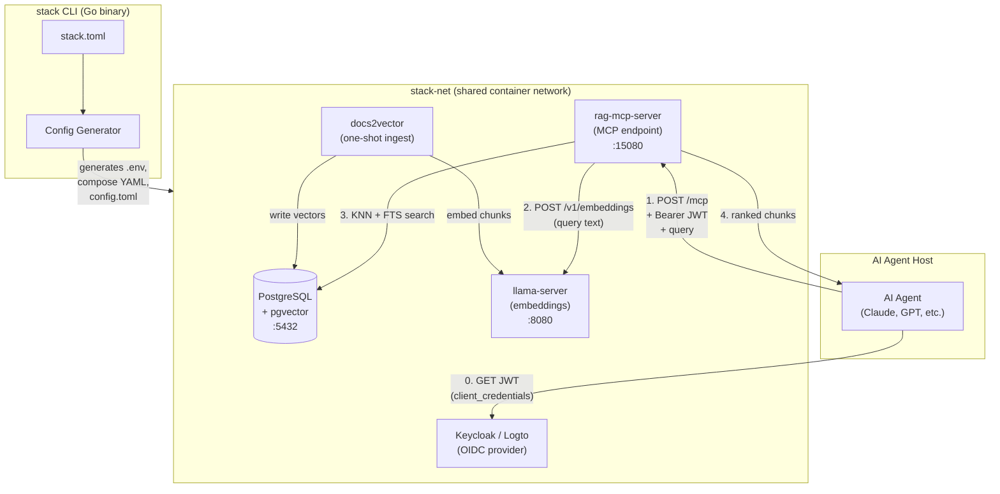
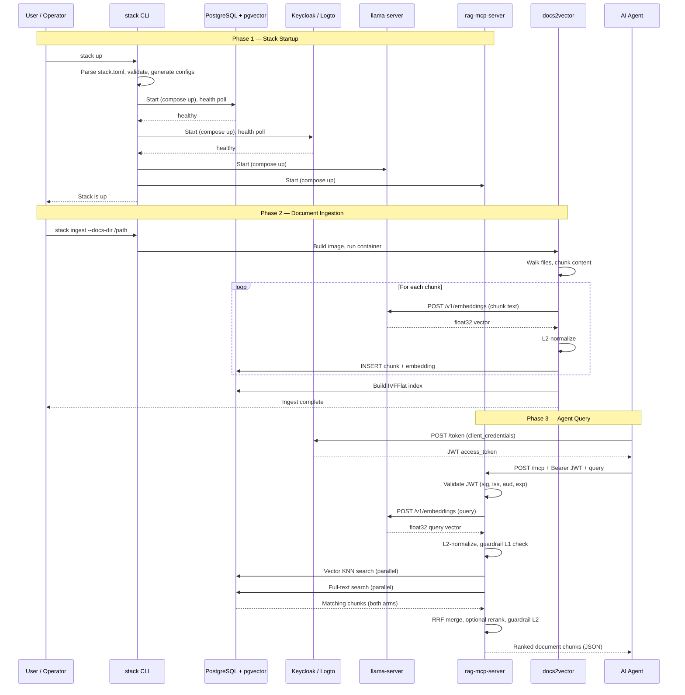

# Overall System Sequence Diagram

This document describes the full end-to-end lifecycle of the stack: from startup
through document ingestion to agent-driven RAG queries.

## System Block Diagram

All components run as separate compose projects on a shared `stack-net` network.
The `stack` CLI reads `stack.toml`, generates per-component configuration files,
and drives podman/docker compose to start each service.

**Components:**

- **stack CLI** — Go binary that parses `stack.toml`, validates configuration,
  generates `.env` and compose files, and orchestrates container lifecycle.
- **PostgreSQL + pgvector** — Shared vector database storing document chunks and
  their embeddings. Supports both KNN vector search and full-text search.
- **llama-server** — Local embedding model server exposing an OpenAI-compatible
  `/v1/embeddings` endpoint. Used by both docs2vector (ingestion) and
  rag-mcp-server (query-time).
- **Keycloak / Logto** — OIDC identity provider issuing JWTs for machine-to-machine
  authentication. Only one can be active at a time.
- **rag-mcp-server** — MCP endpoint that authenticates requests, embeds queries,
  searches the vector store, and returns ranked document chunks.
- **docs2vector** — One-shot ingestion container that walks a document directory,
  chunks content, embeds each chunk via llama-server, and writes vectors to PostgreSQL.

## End-to-End Call Sequence

The sequence has three phases: stack startup, document ingestion, and agent query.

### Phase 1 — Stack Startup

The operator runs `stack up`. The CLI parses and validates `stack.toml`, generates
all configuration files (`.env`, compose YAML, `config.toml`), creates the shared
`stack-net` network, and starts components sequentially. PostgreSQL and the OIDC
provider are health-polled before downstream services start, ensuring dependencies
are ready.

### Phase 2 — Document Ingestion

The operator runs `stack ingest --docs-dir /path`. The CLI builds the docs2vector
image and runs it as a one-shot container. docs2vector walks the document directory,
splits files into chunks, and for each chunk: requests an embedding from llama-server,
L2-normalizes the vector, and inserts the chunk text plus embedding into PostgreSQL.
After all chunks are ingested, it builds an IVFFlat index for fast approximate
nearest-neighbor search.

### Phase 3 — Agent Query

An AI agent authenticates with the OIDC provider using client credentials to obtain
a JWT. It then sends a query to rag-mcp-server via `POST /mcp` with the Bearer token.
The server validates the JWT, embeds the query text via llama-server, L2-normalizes
the vector, and optionally runs a Level 1 guardrail (topic relevance check). It then
executes parallel vector KNN and full-text searches against PostgreSQL, merges results
using Reciprocal Rank Fusion (RRF), optionally applies a Level 2 guardrail (match
quality check) and reranking, and returns the ranked document chunks to the agent.

