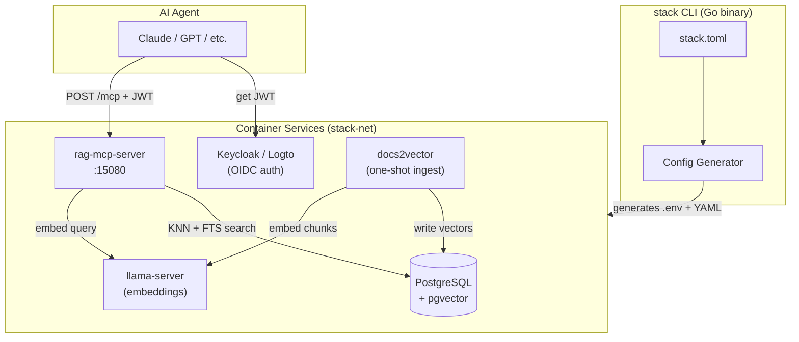
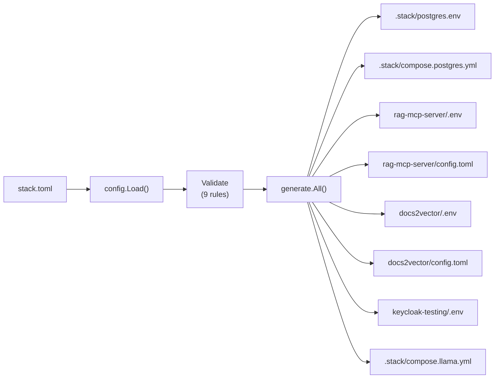
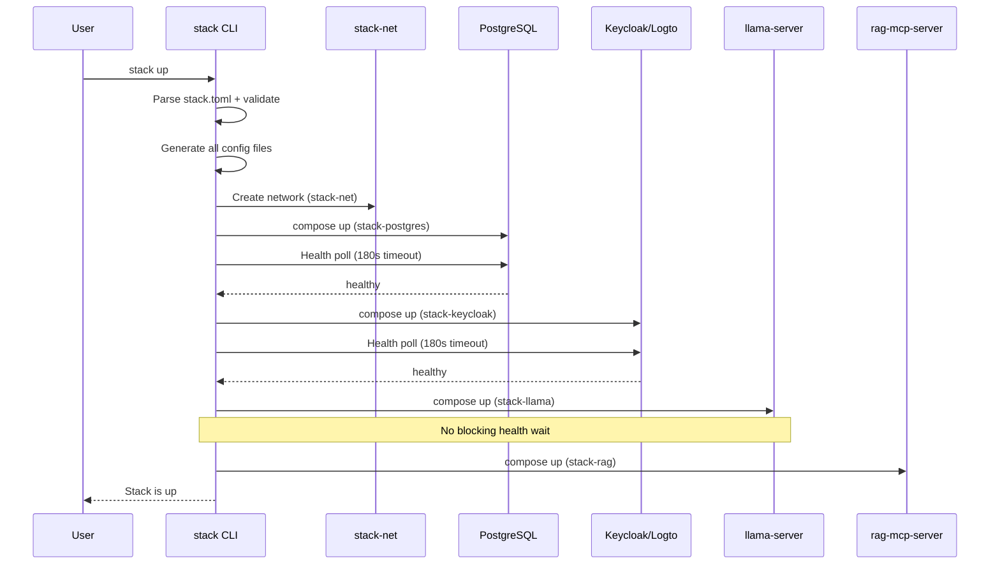
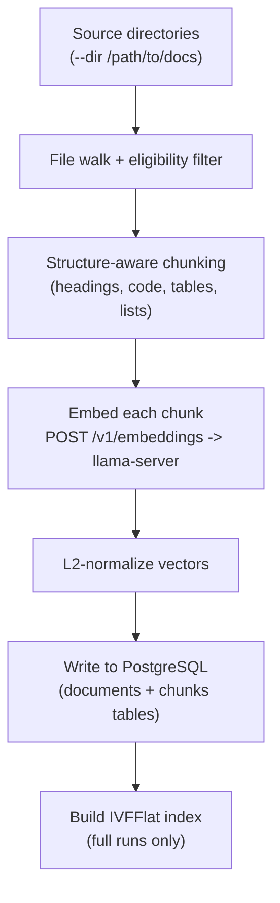
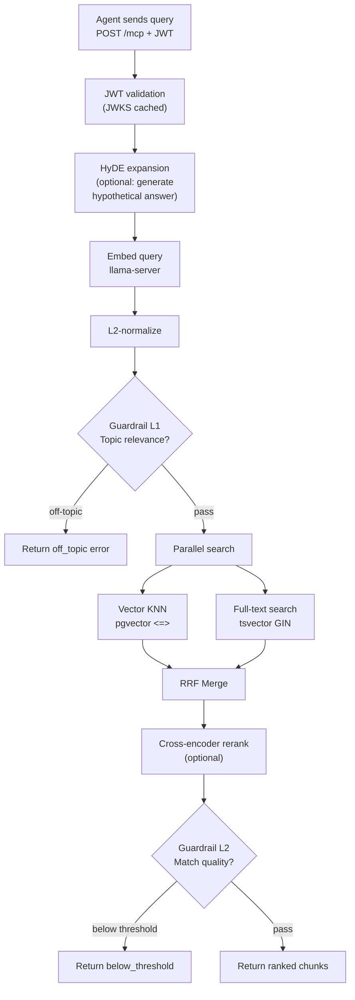
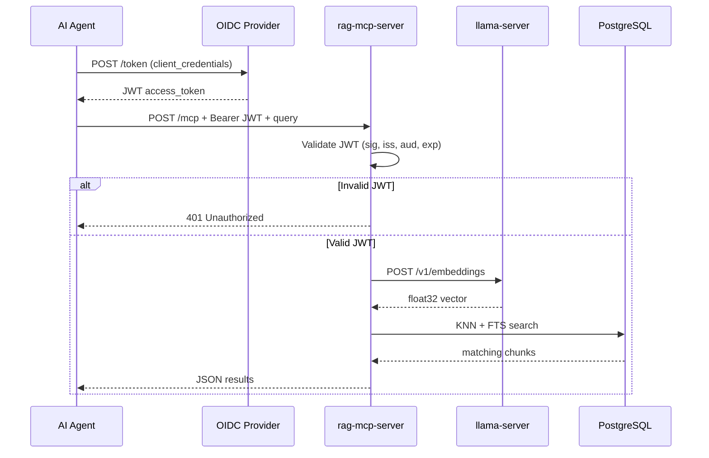

# MCP Server Compose -- Slide Deck Outline

## Slide 1: Title

**MCP Server Compose: A Complete RAG Stack for AI Agents**

Single-binary CLI orchestrating document ingestion, vector search, and
JWT-authenticated MCP services.

---

## Slide 2: The Problem

- AI agents need access to private document corpora
- RAG requires multiple coordinated services: database, embedding server, auth, search
- Each service has its own config, ports, secrets, health checks
- Manual setup is error-prone and hard to reproduce

---

## Slide 3: Solution Overview

- **One config file** (`stack.toml`) drives the entire stack
- **One CLI** (`stack`) generates configs, starts services, manages lifecycle
- Supports podman and docker transparently
- Components: PostgreSQL+pgvector, llama-server, Keycloak/Logto, RAG MCP server, docs2vector

---

## Slide 4: Architecture Block Diagram



---

## Slide 5: The Config File -- stack.toml

- Single source of truth for all services
- Sections: `[runtime]`, `[postgres]`, `[llama]`, `[keycloak]`, `[logto]`, `[rag_mcp_server]`, `[docs2vector]`
- Profile system toggles optional components: `profiles = ["postgres", "keycloak", "llama"]`
- Secrets stay in environment variables (`.envrc`), never in the config file
- Embedding dimension auto-resolved from model name

---

## Slide 6: Config Generation Pipeline



All writes are atomic (temp file then rename). All `.env` files are mode 0600.

---

## Slide 7: Startup Sequence



---

## Slide 8: Compose Project Strategy

- Each component is a **separate compose project** (`-p stack-<name>`)
- Avoids service name collisions (keycloak and logto both define internal `postgres`)
- All projects share the `stack-net` external network
- Projects communicate via container DNS names

| Project | Compose File | Active When |
|---|---|---|
| stack-postgres | .stack/compose.postgres.yml | postgres in profiles |
| stack-keycloak | keycloak-testing/compose.yml | keycloak in profiles |
| stack-logto | logto-testing/compose.yml | logto in profiles |
| stack-llama | .stack/compose.llama.yml | llama in profiles |
| stack-rag | rag-mcp-server/compose.yaml | always |

---

## Slide 9: Document Ingestion Pipeline



- docs2vector is a one-shot CLI tool (no daemon)
- Upsert semantics: re-ingest updates changed documents
- Contextual Chunk Headers: filename + heading breadcrumbs prepended before embedding

---

## Slide 10: Search Pipeline (Query Time)



---

## Slide 11: Authentication Flow



- Keycloak: fully automated setup via init container
- Logto: alternative provider, requires manual admin console setup
- Mutually exclusive -- only one auth provider active at a time

---

## Slide 12: Variable Derivation

Key values are **derived**, not hardcoded:

| Value | Derivation |
|---|---|
| DATABASE_URL (container) | `postgres://<user>:<pass>@stack-postgres:5432/<db>` |
| DATABASE_URL (host) | `postgres://<user>:<pass>@<host>:<port>/<db>` |
| JWKS URL (Keycloak) | `http://keycloak:8080/realms/<realm>/protocol/openid-connect/certs` |
| JWKS URL (Logto) | `http://logto:<port>/oidc/jwks` |
| Embed host (llama in stack) | `http://llama-server:8080` |
| Embed host (external, podman) | `http://host.containers.internal:<port>` |
| Embed dimension | Auto-resolved from model name lookup table |

---

## Slide 13: Security Design

- **No shell interpolation**: all commands use explicit `[]string` argv
- **Secrets in .env only**: mode 0600, never in YAML/TOML configs
- **Input validation**: extra_flags checked for shell metacharacters
- **Atomic file writes**: temp + rename prevents partial/corrupted state
- **Ports bound to 127.0.0.1**: localhost-only by default
- **JWT always required**: no auth bypass mode
- **Parameterized SQL queries**: no string interpolation into SQL
- **DSN never logged**: credentials never appear in log output

---

## Slide 14: Guardrails System

Two opt-in quality gates with zero overhead when disabled:

**Level 1 -- Topic Relevance** (before database query)
- Corpus topic embedded at startup
- Query vector compared via cosine similarity
- Rejects off-topic queries immediately
- Cost: single dot product (~768 multiply-adds)

**Level 2 -- Match Quality** (after search)
- Checks best result score against threshold
- Rejects low-confidence results
- Cost: one float comparison

Both return structured MCP error codes (`off_topic`, `below_threshold`).

---

## Slide 15: Eval Framework

- JSON eval files: `good` (answerable), `bad` (fabricated), `off_topic` cases
- Balanced labels prevent bias (50/50 good/bad typical)
- LLM judge evaluates answer quality
- `bad` evals test hallucination resistance with plausible-sounding fabrications
- Score distributions used to calibrate guardrail thresholds

```
Results: 190/200 passed (95%)
  good (answerable):   90/100 (90%)
  bad  (fabricated):  100/100 (100%)
  off_topic:           25
```

---

## Slide 16: Developer Workflow

```bash
# 1. Configure
cp stack.toml.example stack.toml && $EDITOR stack.toml

# 2. Validate
make validate

# 3. Start everything
make up

# 4. Ingest documents
make ingest ARGS="--docs-dir /path/to/docs"

# 5. Query via MCP
curl -H "Authorization: Bearer $JWT" \
     -d '{"method":"tools/call","params":{"name":"search_documents","arguments":{"query":"..."}}}' \
     http://localhost:15080/mcp

# 6. Stop
make down
```

---

## Slide 17: Technology Stack

| Layer | Technology |
|---|---|
| CLI / Orchestrator | Go (stdlib + BurntSushi/toml) |
| MCP Server | Go (go-sdk MCP, Streamable HTTP) |
| Document Ingestion | Go (docs2vector) |
| Database | PostgreSQL + pgvector |
| Embedding | llama-server (llama.cpp) |
| Auth | Keycloak or Logto (OIDC/JWT) |
| Containers | Podman or Docker (auto-detected) |
| Search | Hybrid vector KNN + full-text, RRF merge |

---

## Slide 18: Key Design Decisions

1. **Separate compose projects** -- avoids service name collisions
2. **Config derivation, not duplication** -- one source of truth
3. **Embedding dim auto-resolution** -- prevents schema mismatches
4. **No shell invocation** -- security by construction
5. **Optional components via profiles** -- use only what you need
6. **Read-only MCP server** -- ingestion is a separate offline step
7. **Podman-first, Docker-compatible** -- no vendor lock-in
8. **Zero-overhead guardrails** -- disabled = one branch instruction
