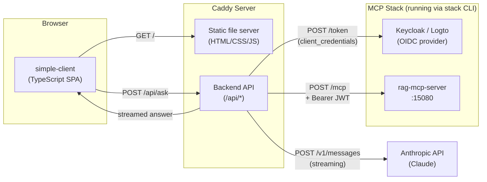
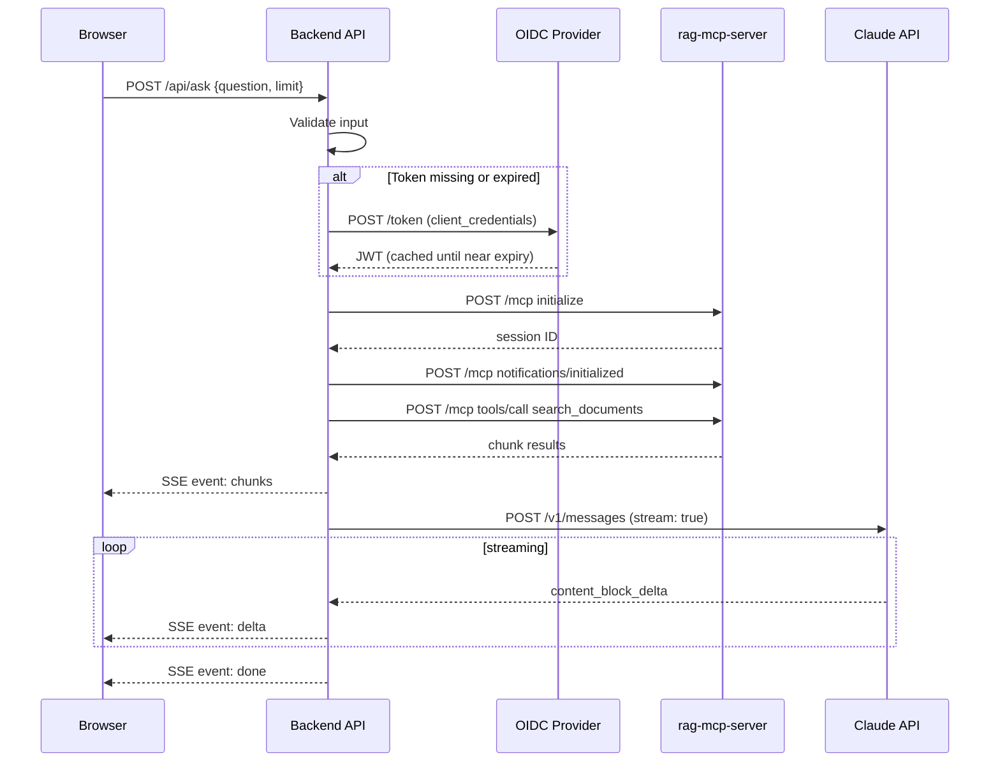

# simple-client -- Requirements

## Purpose

A lightweight, brandable web application that provides a question-and-answer
interface to the RAG MCP server. A user types a natural language question, the
application retrieves relevant document chunks via the MCP `search_documents`
tool, sends the chunks and the question to Claude, and displays the answer. The
application maintains a history of question/answer pairs that the user can
navigate with a slider.

The application is a static TypeScript/HTML/CSS frontend served by
[Caddy](https://caddyserver.com/). A thin backend API (or Caddy middleware)
handles OIDC token acquisition and proxies MCP and LLM calls so that secrets
never reach the browser.

---

## System Context



The browser never sees OIDC credentials, JWT tokens, or the Anthropic API key.
All secret-bearing calls are made server-side by the backend API.

---

## Configuration

### Config file: `config.toml`

A single TOML file provides all configuration. It is gitignored because it
contains secrets. A `config.toml.example` is committed.

```toml
# simple-client/config.toml

[server]
# Address and port Caddy listens on.
listen = ":8090"

# Path to the static frontend assets directory.
static_dir = "./dist"

[mcp]
# Base URL of the rag-mcp-server MCP endpoint.
server_url = "http://localhost:15080"

# Maximum number of document chunks to retrieve per query.
limit = 5

[auth]
# OIDC provider: "keycloak" or "logto".
provider = "keycloak"

# Keycloak credentials (used when provider = "keycloak").
keycloak_issuer        = "http://localhost:8080/realms/dev"
keycloak_client_id     = "my-app"
keycloak_client_secret = "changeme-dev-secret"

# Logto credentials (used when provider = "logto").
# logto_issuer     = "http://localhost:3001"
# logto_app_id     = ""
# logto_app_secret = ""
# logto_audience   = "https://support-mcp"

[llm]
# Anthropic API key for Claude (required).
anthropic_api_key = "sk-ant-..."

# Claude model to use for answer generation.
model = "claude-sonnet-4-10"

# Maximum tokens in the generated answer.
max_tokens = 2048

# System prompt sent to Claude. The application appends the retrieved
# document chunks and the user's question as the user message.
system_prompt = """You are a helpful technical assistant. The user has \
retrieved relevant document excerpts from their documentation corpus \
using semantic search. Use these excerpts as your primary reference, \
citing them by bracketed number [1], [2], etc. when drawing from them. \
Supplement with your own knowledge where the excerpts are incomplete or \
the question goes beyond them -- clearly distinguish when you are doing so."""

[branding]
# Application title shown in the browser tab and page header.
title = "Support Search"

# Path to a logo image file. Served at /logo by Caddy.
# Displayed in the top-left of the page header. Leave empty for no logo.
logo = ""

# Path to a custom CSS file that overrides default styles.
# Loaded after the default stylesheet. Leave empty for default theme.
custom_css = ""
```

### Precedence

Environment variables override `config.toml` values for secrets only:

| Environment variable | Overrides |
|---|---|
| `ANTHROPIC_API_KEY` | `llm.anthropic_api_key` |
| `KEYCLOAK_CLIENT_SECRET` | `auth.keycloak_client_secret` |
| `LOGTO_APP_SECRET` | `auth.logto_app_secret` |

The config file path defaults to `./config.toml`. Override with
`SIMPLE_CLIENT_CONFIG=/path/to/config.toml`.

---

## Architecture

### Frontend (TypeScript SPA)

A single-page application built with TypeScript, compiled to ES modules, and
bundled for production. No framework required -- vanilla TypeScript with the DOM
API is sufficient. The frontend communicates exclusively with the backend API;
it never contacts the MCP server or Anthropic directly.

### Backend API

A small HTTP server (Go binary or Node.js script, implementer's choice) that:

1. Reads `config.toml` at startup.
2. Serves static files from `static_dir`.
3. Serves the branding logo at `GET /logo` (if configured).
4. Serves custom CSS at `GET /custom.css` (if configured).
5. Exposes `POST /api/ask` -- the single API endpoint (see below).
6. Manages OIDC token lifecycle (fetch, cache, refresh before expiry).

### Caddy

Caddy is the user-facing web server. It reverse-proxies `/api/*` to the backend
and serves everything else as static files. If the backend is written in Go, it
may embed Caddy as a library or run standalone behind a Caddyfile. The key
requirement is that the user runs a single process and Caddy handles TLS, HTTP/2,
and static file serving.

A `Caddyfile` is generated or provided:

```
:{listen_port} {
    handle /api/* {
        reverse_proxy localhost:{backend_port}
    }
    handle {
        root * {static_dir}
        file_server
    }
}
```

---

## API

### `POST /api/ask`

The single endpoint the frontend calls.

**Request:**

```json
{
  "question": "How do I configure authentication?",
  "limit": 5
}
```

| Field | Type | Required | Description |
|---|---|---|---|
| `question` | string | yes | Natural language question. Must be non-empty and at most 1000 characters. |
| `limit` | integer | no | Number of chunks to retrieve (1--20). Defaults to `mcp.limit` from config. |

**Response (streamed):**

The response uses `Content-Type: text/event-stream` (Server-Sent Events). This
allows the answer to stream to the browser as Claude generates it.

Event types:

| Event | Data | Description |
|---|---|---|
| `chunks` | JSON array of chunk objects | The retrieved document chunks, sent once before the answer begins. |
| `delta` | `{"text": "..."}` | A fragment of the answer text, streamed as Claude produces it. |
| `done` | `{"answer": "..."}` | The complete answer. Sent once after all deltas. |
| `error` | `{"code": "...", "message": "..."}` | An error. No further events follow. |

Chunk object shape (matches MCP `search_documents` output):

```json
{
  "id": 42,
  "source_path": "docs/auth.md",
  "title": "Authentication Guide",
  "chunk_index": 3,
  "heading_context": "Configuration > JWT",
  "chunk_type": "paragraph",
  "content": "To configure JWT validation...",
  "score": 0.82
}
```

Error codes:

| Code | Meaning |
|---|---|
| `invalid_request` | Missing or invalid `question` field. |
| `auth_error` | Failed to obtain OIDC token. |
| `mcp_error` | MCP server returned an error (includes MCP error code in message). |
| `llm_error` | Claude API call failed. |
| `no_results` | MCP search returned zero chunks. |

**Backend processing sequence:**



---

## Frontend Design

### Layout

The page has three areas arranged in a single responsive layout:

```
+----------------------------------------------------------+
|  [Logo]  Title                                           |
+----------+-----------------------------------------------+
|          |                                               |
|  History |   Question                                    |
|  Slider  |   +---------------------------------------+   |
|          |   | [question text box - scrollable]       |   |
|   < # >  |   +---------------------------------------+   |
|          |                                               |
|          |   Answer                                      |
|          |   +---------------------------------------+   |
|          |   | [answer text box - scrollable]         |   |
|          |   |                                        |   |
|          |   |                                        |   |
|          |   +---------------------------------------+   |
|          |                                               |
|          |   [Ask button]                                |
+----------+-----------------------------------------------+
```

#### Header

- Logo image (left, from `branding.logo`). Hidden when not configured.
- Application title (from `branding.title`).
- No navigation links.

#### History slider (left panel)

- A vertical strip on the left side of the page.
- Displays the current pair index and total count: `3 / 12`.
- Navigation controls:
  - **Previous** (`<` or left arrow key): show the previous Q&A pair.
  - **Next** (`>` or right arrow key): show the next Q&A pair.
  - **New** (`+` button or keyboard shortcut): clear the question box and
    start a new question. The new pair is not added to history until the
    answer completes.
- The slider is a range input (or equivalent) that allows jumping directly
  to any pair by position.
- When the user is viewing a historical pair, the question and answer boxes
  are read-only. Only the latest (current) pair is editable.
- The panel collapses to an icon on narrow screens (< 768px) and opens as
  an overlay when tapped.

#### Question box

- A multi-line text input (`<textarea>`) for the user's question.
- Scrollable vertically when content exceeds the visible area.
- Maximum input length: 1000 characters (enforced client-side with a
  character counter, and server-side).
- Pressing `Ctrl+Enter` (or `Cmd+Enter` on macOS) submits the question.
- Disabled while an answer is streaming.

#### Answer box

- A read-only display area for the answer.
- Scrollable vertically when content exceeds the visible area.
- Supports basic Markdown rendering (headings, bold, italic, code blocks,
  lists, links) so Claude's formatted output is readable.
- While streaming, text appears progressively as `delta` events arrive.
- A subtle loading indicator (pulsing dot or spinner) is shown while the
  answer is streaming.
- Below the answer, a collapsible "Sources" section lists the retrieved
  chunks with their source path, heading context, score, and a truncated
  preview. Clicking a source expands it to show the full chunk content.

#### Ask button

- Labeled "Ask" (or a send icon).
- Disabled when the question box is empty or while an answer is streaming.
- Triggers `POST /api/ask`.

### Keyboard shortcuts

| Key | Action |
|---|---|
| `Ctrl+Enter` / `Cmd+Enter` | Submit question |
| `Left Arrow` | Previous Q&A pair (when question box is not focused) |
| `Right Arrow` | Next Q&A pair (when question box is not focused) |
| `Ctrl+N` / `Cmd+N` | New question |

---

## Q&A Pair Model

A question and its answer form an atomic pair. They are always displayed and
navigated together.

```typescript
interface QAPair {
    id: number;              // sequential, 1-based
    question: string;        // the user's question text
    answer: string;          // the complete answer text (empty while streaming)
    chunks: ChunkResult[];   // retrieved document chunks
    timestamp: Date;         // when the question was submitted
    status: "streaming" | "complete" | "error";
    error?: string;          // error message if status is "error"
}
```

### Storage

- Pairs are stored in memory (JavaScript array) for the duration of the
  browser session.
- Pairs persist across page reloads using `sessionStorage`. The full array
  is serialized as JSON.
- There is no server-side persistence. Closing the browser tab clears history.
- Maximum history size: 100 pairs. When exceeded, the oldest pair is discarded.

### Navigation

- The history slider position maps 1:1 to the pairs array index.
- Navigating to a pair populates the question box and answer box with that
  pair's content. Both boxes become read-only for historical pairs.
- The "current" position (rightmost slider position) is always the active
  question. If no question is in progress, the boxes are empty and editable.
- While an answer is streaming, navigation is disabled. The user must wait
  for the stream to complete (or for an error) before navigating.

---

## Branding

### Default theme

The application ships with a clean, neutral default theme:

- White background, dark text.
- System font stack (`-apple-system, BlinkMacSystemFont, "Segoe UI", Roboto,
  sans-serif`).
- Accent color for the Ask button and active slider position: `#2563eb`
  (blue).
- Subtle borders and rounded corners on the text boxes.
- The answer box has a light gray background (`#f9fafb`) to visually
  distinguish it from the question box.

### Custom CSS

When `branding.custom_css` points to a CSS file, it is loaded after the
default stylesheet. It can override any default style. The default stylesheet
uses CSS custom properties (variables) for easy theming:

```css
:root {
    --color-primary: #2563eb;
    --color-background: #ffffff;
    --color-surface: #f9fafb;
    --color-text: #111827;
    --color-text-muted: #6b7280;
    --color-border: #e5e7eb;
    --font-family: -apple-system, BlinkMacSystemFont, "Segoe UI", Roboto, sans-serif;
    --font-family-mono: "SF Mono", "Fira Code", "Fira Mono", monospace;
    --border-radius: 8px;
    --spacing-unit: 8px;
}
```

A custom CSS file can override just the variables for a quick rebrand:

```css
:root {
    --color-primary: #059669;
    --color-background: #f0fdf4;
}
```

Or override individual classes for deeper customization.

### Logo

When `branding.logo` is set, the image is served at `/logo` by the backend and
displayed in the header. Supported formats: PNG, SVG, JPEG. The logo is
displayed at a fixed height (40px) with auto width to preserve aspect ratio.

---

## Error Handling

### Network errors

- If `POST /api/ask` fails to connect, display an inline error in the answer
  box: "Connection error: unable to reach the server."
- If the SSE stream disconnects mid-answer, display what has been received so
  far, followed by a warning: "Stream interrupted. The answer may be
  incomplete."

### Application errors

- Errors from the backend (`error` SSE event) are displayed in the answer box
  with the error code and message.
- The Q&A pair is saved with `status: "error"` so the user can see it in
  history.

### Input validation

- Empty questions are rejected client-side (the Ask button is disabled).
- Questions exceeding 1000 characters are rejected client-side (character
  counter turns red; Ask button disabled).
- The backend also validates and returns `invalid_request` if the question is
  empty or too long.

---

## Build and Run

### Prerequisites

- [Node.js](https://nodejs.org/) (20+) -- for building the TypeScript frontend
- [Caddy](https://caddyserver.com/) -- web server
- A running MCP stack (`make up` from the parent repository)
- `ANTHROPIC_API_KEY` set (or in `config.toml`)

### Makefile targets

| Target | Description |
|---|---|
| *(default)* | Print available targets |
| `build` | Compile TypeScript, bundle frontend assets into `dist/` |
| `dev` | Start the backend in development mode with live reload |
| `run` | Build and start the production server (Caddy + backend) |
| `clean` | Remove `dist/` and build artifacts |
| `test` | Run frontend unit tests |

### Quick start

```sh
cp config.toml.example config.toml
$EDITOR config.toml          # set auth credentials and API key

make build
make run                      # starts on http://localhost:8090
```

---

## Project Structure

```
simple-client/
├── REQUIREMENTS.md           # this document
├── config.toml.example       # committed config template (no secrets)
├── config.toml               # gitignored -- operator fills in secrets
├── Caddyfile                 # generated or static Caddy config
├── Makefile
├── .gitignore
├── src/
│   ├── index.html            # single-page HTML shell
│   ├── main.ts               # entry point: wires up UI, event handlers, SSE
│   ├── api.ts                # POST /api/ask, SSE event parsing
│   ├── history.ts            # QAPair model, sessionStorage persistence, slider
│   ├── markdown.ts           # lightweight Markdown-to-HTML renderer
│   ├── styles.css            # default theme with CSS custom properties
│   └── types.ts              # shared TypeScript interfaces
├── backend/
│   ├── main.go (or index.ts) # backend API server
│   ├── config.go             # TOML config loader
│   ├── auth.go               # OIDC token fetch + cache
│   ├── mcp.go                # MCP protocol client (initialize, tool call)
│   └── llm.go                # Claude streaming API client
├── dist/                     # gitignored -- built frontend assets
└── tsconfig.json
```

---

## Security

- **No secrets in the browser.** OIDC credentials, JWT tokens, and the
  Anthropic API key never leave the backend. The frontend only talks to
  `/api/*`.
- **CORS not required.** The frontend and backend are served from the same
  origin via Caddy.
- **Input sanitization.** The Markdown renderer must sanitize output to
  prevent XSS. No raw `innerHTML` from user input or LLM output without
  sanitization.
- **Rate limiting.** The backend should enforce a basic rate limit on
  `/api/ask` (e.g., 10 requests per minute per IP) to prevent abuse.
- **Token caching.** The backend caches OIDC tokens in memory and refreshes
  them before expiry. Tokens are never sent to the browser or logged.
- **HTTPS.** Caddy automatically provisions TLS when a domain name is
  configured in `server.listen`. For local development with `:8090`, plain
  HTTP is used.

---

## Non-Requirements (Explicit Exclusions)

- Multi-user authentication or user accounts. The application is
  single-tenant; anyone who can reach the URL can use it.
- Persistent server-side history or database.
- Conversation context (multi-turn). Each question is independent; the LLM
  does not see prior Q&A pairs.
- File upload or document management.
- Admin interface.
- Mobile-native application.
- Offline support or service workers.
- Internationalization.
